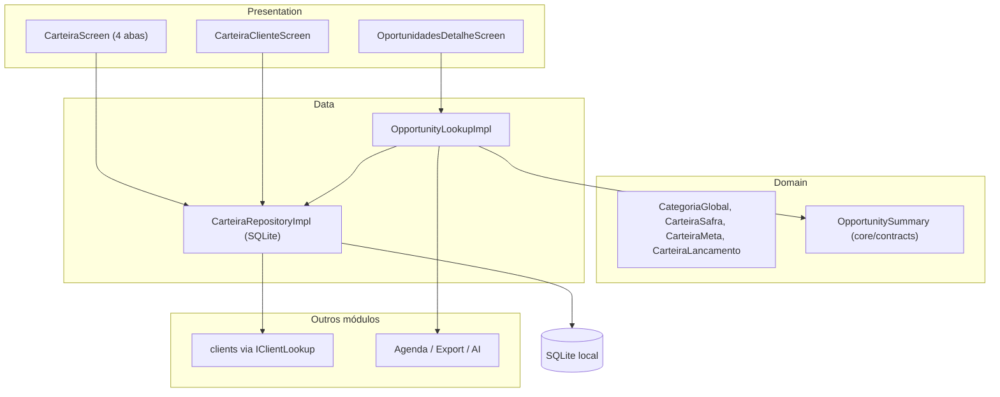
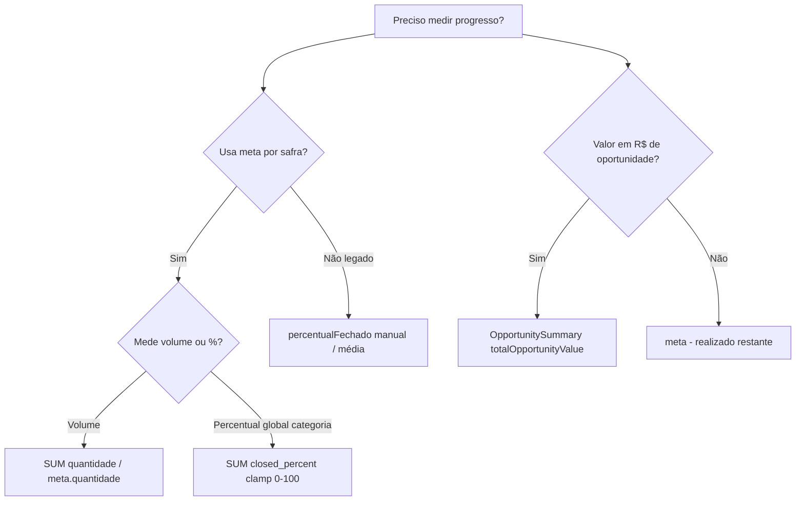

# Módulo Carteira — Como Funciona

**Status:** ATIVO  
**Bounded context:** `lib/modules/carteira/`  
**Contratos:** ADR-029 (`IOpportunityLookup`), `IClientLookup` (ADR-015)  
**Referência de regras:** `lib/modules/carteira/AGENTS.md`

---

## Propósito

O módulo [`lib/modules/carteira/`](../../lib/modules/carteira/) gerencia o **pipeline comercial** do agrônomo: categorias de produtos, metas por safra, lançamentos de fechamento por cliente e identificação de **oportunidades abertas**. É um bounded context isolado que consome clientes via contrato [`IClientLookup`](../../lib/core/contracts/i_client_lookup.dart) e expõe oportunidades via [`IOpportunityLookup`](../../lib/core/contracts/i_opportunity_lookup.dart) (ADR-029).



---

## Arquitetura

| Camada | Pasta | Responsabilidade |
|--------|-------|------------------|
| Domain | [`domain/entities/`](../../lib/modules/carteira/domain/entities/), [`domain/enums/`](../../lib/modules/carteira/domain/enums/), [`domain/repositories/`](../../lib/modules/carteira/domain/repositories/) | Entidades, unidades de medida, contrato `ICarteiraRepository` |
| Data | [`carteira_repository_impl.dart`](../../lib/modules/carteira/data/repositories/carteira_repository_impl.dart), [`opportunity_lookup_impl.dart`](../../lib/modules/carteira/data/opportunity_lookup_impl.dart) | Persistência SQLite + implementação ADR-029 |
| Presentation | [`presentation/screens/`](../../lib/modules/carteira/presentation/screens/), [`presentation/widgets/`](../../lib/modules/carteira/presentation/widgets/), [`carteira_providers.dart`](../../lib/modules/carteira/presentation/providers/carteira_providers.dart) | UI, dialogs, Riverpod |

**Regra do módulo** ([`AGENTS.md`](../../lib/modules/carteira/AGENTS.md)): regras comerciais devem ficar em domain/data; sem import direto de outros `modules/*`.

---

## Modelo de Dados

### Entidades principais

1. **`CategoriaGlobal`** — tipo de produto/serviço (Nutrição, Defensivos, Sementes, etc.)
   - `unidade`: como interpretar `valorReferencia` ([`UnidadeCategoria`](../../lib/modules/carteira/domain/enums/unidade_categoria.dart))
   - `valorReferencia`: custo/meta de referência (R$/ha, ton/ha, Big Bag, Sacas 60k)
   - Campos legados (`valorReal`, `valorDolar`, `sacasPorHa`) — só leitura, não usar em lógica nova

2. **`CarteiraSafra`** — período comercial (ex.: Safra 25/26)
   - Apenas **uma safra ativa** por usuário

3. **`CarteiraMeta`** — meta global por **categoria × safra** (não por cliente)
   - `quantidade`: alvo numérico na unidade da categoria

4. **`CarteiraLancamento`** — registro de fechamento por **cliente × categoria × safra**
   - `quantidade`: volume realizado (SUM para progresso por meta)
   - `closedPercent`: % fechado (0–100), usado em oportunidades ADR-029
   - `tipoFechamento`: vendido / perdido (opcional)
   - Campos de concorrência e motivo

5. **`ClienteCategoria`** *(legado)* — % manual por cliente/categoria
   - `percentualFechado` (0–100) na tabela `carteira_cliente_categorias`

### Unidades de categoria

| Unidade | Label | Significado |
|---------|-------|-------------|
| `realPorHa` | R$/ha | Custo por hectare; convertível em sacas via preço do grão |
| `toneladaPorHa` | ton/ha | Meta de fertilizante por área |
| `bigBag` | Big Bag | Unidade absoluta (sementes soja) |
| `sacas60k` | Sacas 60k | Unidade absoluta (sementes milho) |

### Tabelas SQLite (migrations V22–V29)

- `carteira_categorias`, `carteira_cliente_categorias` (legado)
- `carteira_config` — `valor_grao` global por usuário
- `carteira_safras`, `carteira_metas`, `carteira_lancamentos`

Persistência **local only** — sem sync Supabase; lançamentos permitem hard delete.

---

## Fluxos de Usuário

### Rotas

- `/carteira` → [`CarteiraScreen`](../../lib/modules/carteira/presentation/screens/carteira_screen.dart)
- `/carteira/cliente/:clienteId` → [`CarteiraClienteScreen`](../../lib/modules/carteira/presentation/screens/carteira_cliente_screen.dart)

### Abas da tela principal

1. **Clientes** — lista via `IClientLookup.listAtivos()`; exibe média legada de % fechado; tap abre detalhe do cliente
2. **Categorias** — CRUD de categorias; exibe `custoSacasHa` quando aplicável
3. **Metas** — [`CarteiraMetasTab`](../../lib/modules/carteira/presentation/widgets/carteira_metas_tab.dart): preço do grão, safra ativa, meta por categoria + barra de progresso
4. **Oportunidades** — clientes com oportunidades abertas (modelo meta-based); tap abre [`OportunidadesDetalheScreen`](../../lib/modules/carteira/presentation/screens/oportunidades_detalhe_screen.dart)

### Detalhe do cliente

Por categoria: meta vs realizado, botão **Lançamento** ([`LancamentoFormDialog`](../../lib/modules/carteira/presentation/widgets/lancamento_form_dialog.dart)), histórico expansível, long-press para editar % legado.

---

## Cálculos do Sistema

### 1. Oportunidade comercial (ADR-029) — `OpportunitySummary`

Contrato neutro em [`opportunity_summary.dart`](../../lib/core/contracts/opportunity_summary.dart):

```
closedValuePerHa   = referenceValuePerHa × closedPercent / 100
residualValuePerHa = referenceValuePerHa - closedValuePerHa
residualPercent    = 100 - closedPercent
totalOpportunityValue = residualValuePerHa × areaHa
```

**Exemplo testado** ([`opportunity_summary_test.dart`](../../test/modules/carteira/domain/opportunity_summary_test.dart)):

- ref = R$ 1.000/ha, fechado = 40%, área = 500 ha
- `totalOpportunityValue` = 600 × 500 = **R$ 300.000**

**Origem dos inputs** ([`OpportunityLookupImpl`](../../lib/modules/carteira/data/opportunity_lookup_impl.dart)):

- `referenceValuePerHa` ← `categoria.valorReferencia`
- `closedPercent` ← `SUM(closed_percent)` dos lançamentos do cliente+categoria, clamp 0–100
- `areaHa` ← `clients.area_total` (tabela consultoria, lida via SQLite compartilhado)
- Filtra categorias com `residualPercent > 0`; ordena por `totalOpportunityValue` decrescente

**Consumidores:** aba Oportunidades (detalhe), módulo **Agenda** (seção de oportunidades ao criar visita), export de agenda, adapter **Agenda AI**.

---

### 2. Conversão R$/ha → sacas/ha — `CategoriaGlobal.custoSacasHa`

Em [`categoria_global.dart`](../../lib/modules/carteira/domain/entities/categoria_global.dart):

```
custoSacasHa = valorReferencia / valorGrao
```

Só quando `unidade == realPorHa` e ambos valores > 0. Usado na aba Categorias com o preço do grão de `carteira_config`.

---

### 3. Realizado (volume) — SQL SUM(quantidade)

Em [`carteira_repository_impl.dart`](../../lib/modules/carteira/data/repositories/carteira_repository_impl.dart):

```
realizadoSafraCategoria     = SUM(quantidade) WHERE safra + categoria
realizadoClienteCategoria   = SUM(quantidade) WHERE cliente + categoria + safra
```

Usado por:

- `realizadoCategoriaProvider` / `realizadoClienteCategoriaProvider`
- Barra de progresso em [`CarteiraClienteScreen`](../../lib/modules/carteira/presentation/screens/carteira_cliente_screen.dart):

```
pct = (realizado / meta.quantidade × 100).clamp(0, 100)
```

---

### 4. Progresso por categoria (safra) — SUM(closed_percent)

Em [`carteira_providers.dart`](../../lib/modules/carteira/presentation/providers/carteira_providers.dart), `progressoCategoriaProvider`:

```
progresso = SUM(lancamento.closedPercent).clamp(0, 100)
```

Soma todos os lançamentos da categoria na safra ativa (não filtra por cliente).

---

### 5. Oportunidades por meta (modelo interno) — `OportunidadeCliente`

Provider `oportunidadesClienteProvider` (aba Oportunidades da tela principal):

```
progressoPct = (realizado / meta.quantidade × 100).clamp(0, 100)
restante     = (metaQuantidade - realizado).clamp(0, ∞)
isAberta     = progressoPct < 100
```

Ordena por menor progresso primeiro; retorna só abertas.

---

### 6. Média legada por cliente — `mediaCliente`

Em [`carteira_screen.dart`](../../lib/modules/carteira/presentation/screens/carteira_screen.dart):

```
media = SUM(percentualFechado por categoria) / totalCategorias
```

Usa tabela legada `carteira_cliente_categorias`, **não** os lançamentos novos.

---

### 7. Visualização de oportunidades — gráfico de pizza

Em [`oportunidades_detalhe_screen.dart`](../../lib/modules/carteira/presentation/screens/oportunidades_detalhe_screen.dart):

```
totalOpportunityValue = Σ op.totalOpportunityValue
percentOfTotal        = op.totalOpportunityValue / total × 100
```

Fatias do pie chart proporcionais ao valor residual por categoria.

---

### 8. Adapter Agenda AI (fora do módulo)

[`agenda_ai_recommendation_context_adapter.dart`](../../lib/app/adapters/agenda_ai_recommendation_context_adapter.dart):

- Seleciona meta com maior `(meta.quantidade - achieved).clamp(0, ∞)`
- `categoryAchievedValue = target.quantidade × registro.percentualFechado / 100` (legado)
- `annualAchievedValue = getRealizadoBySafraCategoria` (SUM quantidade)

---

## Dois modelos de progresso (importante)

O módulo opera **dois sistemas em paralelo**:

| Aspecto | Modelo legado | Modelo safra (novo) |
|---------|---------------|---------------------|
| Tabela | `carteira_cliente_categorias` | `carteira_lancamentos` |
| Métrica | `percentualFechado` manual | `closedPercent` + `quantidade` |
| Onde aparece | Média na lista de clientes | Lançamentos, ADR-029, metas |
| Oportunidade | — | `IOpportunityLookup` |

**Divergência crítica:** [`LancamentoFormDialog._salvar`](../../lib/modules/carteira/presentation/widgets/lancamento_form_dialog.dart) persiste sempre `quantidade: 0.0` e só preenche `closedPercent`. Consequência:

- Cálculos baseados em **SUM(closed_percent)** funcionam (ADR-029, `progressoCategoriaProvider`)
- Cálculos baseados em **SUM(quantidade)** ficam em **0** para lançamentos novos (barra meta/realizado, `oportunidadesClienteProvider`)

Isso explica por que a aba **Oportunidades** usa dois caminhos distintos: lista principal via meta/quantidade vs detalhe via `OpportunitySummary`/R$.

---

## Integrações cross-module

| Contrato | Direção | Uso |
|----------|---------|-----|
| `IClientLookup` | Consome | Lista e detalhe de clientes + `areaTotal` indiretamente |
| `IOpportunityLookup` | Expõe | Agenda, export, tela de detalhe |
| `OpportunitySummary` | Expõe (DTO) | Valores calculados de oportunidade |

Wiring em [`main.dart`](../../lib/main.dart): override de `opportunityLookupProvider` com `OpportunityLookupImpl`.

**Proibido:** import direto de `consultoria/` — fronteira só via contratos.

---

## Providers Riverpod (resumo)

Arquivo: [`carteira_providers.dart`](../../lib/modules/carteira/presentation/providers/carteira_providers.dart)

- **Config:** `valorGraoProvider`, `safrasProvider`, `safraAtivaProvider`
- **Dados:** `categoriasGlobaisProvider`, `metasSafraAtivaProvider`, `lancamentosSafraProvider`
- **Agregações:** `realizadoCategoriaProvider`, `realizadoClienteCategoriaProvider`, `progressoCategoriaProvider`
- **Oportunidades:** `clientOpportunitiesProvider` (ADR-029), `oportunidadesClienteProvider` (meta-based)
- **Clientes:** `carteiraClientesProvider`, `carteiraClienteByIdProvider` (via `IClientLookup`)

---

## Testes existentes

Pasta [`test/modules/carteira/`](../../test/modules/carteira/):

- `opportunity_summary_test.dart` — fórmulas ADR-029
- `categoria_global_test.dart` — `custoSacasHa`, serialização
- `carteira_lancamento_test.dart` — clamp de `percentualFechado`
- `unidade_categoria_test.dart` — round-trip enum

Sem testes de widget ou integração de repositório hoje.

---

## Diagrama de decisão — qual cálculo usar?



---

## Conclusão

O módulo **Carteira** é o centro comercial do SoloForte: categoriza produtos, define metas por safra, registra fechamentos por cliente e calcula oportunidades residuais em R$ (via área × valor/ha × % aberto). A arquitetura respeita bounded contexts via `IClientLookup` e `IOpportunityLookup`, mas convive com um modelo legado de percentuais manuais e uma inconsistência entre `quantidade` e `closedPercent` nos lançamentos novos — ponto central para interpretar métricas na UI.
