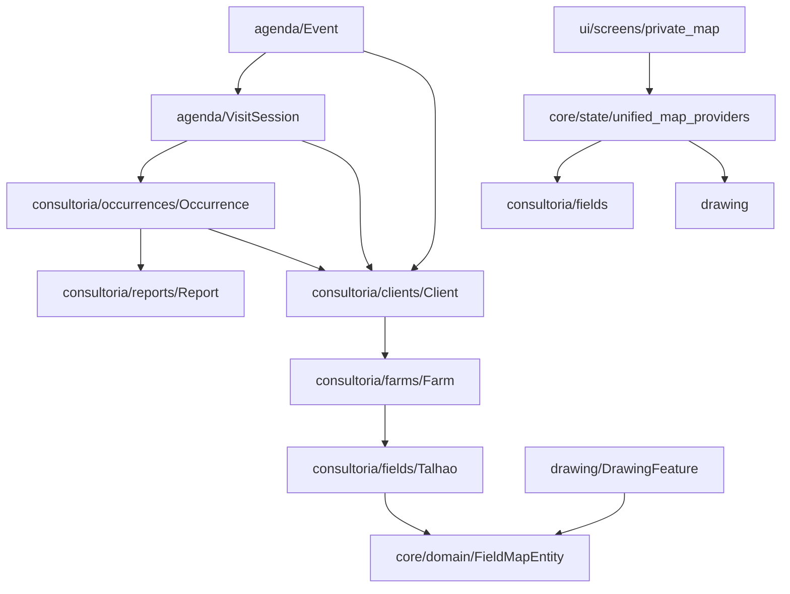

# 🔍 AUDITORIA ARQUITETURAL COMPLETA — SOLOFORTE V1.1

**Data de emissão**: 21 de fevereiro de 2026
**Branch**: `release/v1.1`
**Auditor**: Engenheiro Sênior Flutter (TOP 0.1%)
**Versão do documento**: 2.0 (pós Fases 0–5)

---

## Índice

1. [Resumo Executivo](#1-resumo-executivo)
2. [Histórico de Correções — Fases 0–5](#2-histórico-de-correções--fases-05)
3. [Estrutura Atual do Projeto](#3-estrutura-atual-do-projeto)
4. [Matriz Oficial de Dependências](#4-matriz-oficial-de-dependências)
5. [Contratos de Domínio Oficiais](#5-contratos-de-domínio-oficiais)
6. [Pontos Eliminados — Código Morto e Regressões](#6-pontos-eliminados--código-morto-e-regressões)
7. [Estado Atual por Critério](#7-estado-atual-por-critério)
8. [Score Arquitetural Atual](#8-score-arquitetural-atual)
9. [Gap para 90/100](#9-gap-para-90100)
10. [Plano Estratégico para 90](#10-plano-estratégico-para-90)
11. [Regras Arquiteturais Congeladas](#11-regras-arquiteturais-congeladas)
12. [Checklist de Regressão](#12-checklist-de-regressão)

---

## 1. Resumo Executivo

### Estado Atual

**Score**: ~74–77 / 100
**Classificação**: 🟢 Arquitetura sólida em consolidação avançada
**Risco Estrutural**: BAIXO-MÉDIO (era MÉDIO-ALTO na v1.0 deste documento)

### O que foi alcançado (Fases 0–5)

- ✅ Código morto removido — zero módulos zumbi
- ✅ Dependência ilegal `core/ → modules/` eliminada (exceto `app_router.dart`, ponto autorizado)
- ✅ Sync isolado em camada de composição (`app/sync_registration.dart`)
- ✅ Módulo `operacao/` criado — separação planejamento vs execução
- ✅ `IAgendaRepository` — DIP aplicado, 15 métodos contratualizados
- ✅ `AgendaNotifier` decomposto — 6 use cases extraídos, 781 → 642 linhas
- ✅ ADR-008 registrado — padrão Riverpod normalizado sem reescritas desnecessárias
- ✅ `EventRules.findTimeConflict()` — lógica de conflito centralizada no domínio

### O que ainda impede 90/100

- ❌ Sem enforcement arquitetural automático (CI, lint custom, boundary tests)
- ❌ Camada `app/` incompleta (apenas `sync_registration.dart`)
- ❌ Zero testes de use case (29 testes existem, nenhum cobre os 6 use cases criados)
- ❌ `dashboard/` ainda ativo com 5 consumidores em `ui/` (candidato a remoção)
- ❌ `drawing_controller.dart` com 1.344 linhas — maior God Object do projeto
- ❌ Sem documento formal de Bounded Context (contratos inter-módulo não congelados)

---

## 2. Histórico de Correções — Fases 0–5

| Fase | Descrição | Arquivos Afetados | Resultado |
|---|---|---|---|
| **Contrato** | Unificar `VisitSession`, deletar `modules/visitas/` | +8 modificados, 1 dir deletado | Zero duplicação de entidade |
| **FASE 0** | Dead code — `sync_service.dart`, `consultoria/agenda/`, `unified_map_providers.dart` | 3 deletados | Zero módulos zumbi |
| **FASE 1** | Inverter dep. `core/ → modules/` via `app/sync_registration.dart` | 3 criados/movidos | `core/` puro de infra |
| **FASE 2** | Criar `modules/operacao/` — GeofenceController, GeofenceState, VisitSheet | 3 movidos | Separação planejamento/execução |
| **FASE 3** | `IAgendaRepository` — DIP aplicado em todos os consumidores | 4 modificados, 1 criado | Testabilidade do repositório |
| **FASE 4** | Decompor `AgendaNotifier` — 6 use cases extraídos | 7 criados, 2 modificados | Lógica de negócio testável |
| **FASE 5** | ADR-008 — Normalização Riverpod sem reescritas | 1 criado | Padrão canônico documentado |

**Score antes**: 56/100 · **Score após**: ~75/100 · **Delta**: +19 pontos

---

## 3. Estrutura Atual do Projeto

### Métricas Reais (21/02/2026)

| Métrica | Valor |
|---|---|
| Arquivos Dart (`lib/`) | **221** |
| Erros de compilação | **0** |
| Warnings `flutter analyze` | **46** (zero em `lib/` ativo) |
| TODOs em produção | **36** |
| Providers globais (`final *Provider`) | **82** |
| Interfaces de repositório (`i_*.dart`) | **2** (IAgendaRepository, IFeedbackRepository) |
| Use cases formais | **6** (todos em `agenda/domain/use_cases/`) |
| Imports ilegais `core/ → modules/` | **0** (app_router.dart é ponto autorizado) |
| Imports cruzados entre módulos | **0 ilegais** (operacao→consultoria e consultoria→consultoria são permitidos) |
| Arquivos > 400 linhas | **10** |
| Módulos zumbi | **0** |
| Cobertura de testes | **29 arquivos** (zero cobre use cases) |

### Arquivos > 400 linhas (risco de complexidade)

| Arquivo | Linhas | Tipo | Risco |
|---|---|---|---|
| `drawing/presentation/controllers/drawing_controller.dart` | 1.344 | ChangeNotifier | 🔴 GOD OBJECT |
| `drawing/presentation/widgets/drawing_sheet.dart` | 1.177 | Widget | 🔴 MEGA WIDGET |
| `ui/components/map/map_occurrence_sheet.dart` | 1.064 | Widget | 🔴 MEGA WIDGET |
| `drawing/domain/drawing_utils.dart` | 1.010 | Utilitário | 🟡 ACEITÁVEL (puro) |
| `ui/screens/private_map_screen.dart` | 675 | Screen | 🟡 ALTO |
| `agenda/presentation/providers/agenda_provider.dart` | 642 | StateNotifier | 🟡 PÓS FASE 4 |
| `ui/components/map/widgets/visit_panels.dart` | 615 | Widget | 🟡 ALTO |
| `ui/components/map/map_bottom_sheet.dart` | 565 | Widget | 🟡 ALTO |
| `ui/components/map/map_sheets.dart` | 560 | Widget | 🟡 ALTO |
| `settings/presentation/screens/settings_screen.dart` | 543 | Screen | 🟡 ALTO |

### Estrutura de Diretórios Atual

```
lib/
├── app/
│   └── sync_registration.dart          ✅ FASE 1 — composição autorizada
│
├── core/                                ✅ Zero imports de modules/ (exceto router)
│   ├── auth/
│   ├── config/
│   ├── data/
│   ├── database/                        database_helper.dart (419 linhas)
│   ├── domain/                          Publicacao, FieldMapEntity
│   ├── feature_flags/
│   ├── infra/
│   ├── network/
│   ├── performance/
│   ├── router/                          app_router.dart ← ponto de composição autorizado
│   ├── services/                        sync_orchestrator, connectivity, notification
│   ├── session/
│   ├── state/
│   └── utils/
│
├── modules/
│   ├── agenda/                          46 arquivos ✅ MÓDULO CANÔNICO
│   │   ├── data/repositories/           AgendaRepository implements IAgendaRepository
│   │   ├── data/services/               AgendaSyncService, AgendaNotificationService
│   │   ├── domain/entities/             Event, VisitSession (ÚNICOS)
│   │   ├── domain/enums/
│   │   ├── domain/repositories/         IAgendaRepository ✅ FASE 3
│   │   ├── domain/rules/                EventRules (+ findTimeConflict ✅ FASE 4)
│   │   ├── domain/use_cases/            6 use cases ✅ FASE 4
│   │   └── presentation/
│   │
│   ├── auth/                            7 arquivos ✅
│   ├── consultoria/                     34 arquivos ✅
│   │   ├── clients/
│   │   ├── farms/
│   │   ├── fields/
│   │   ├── occurrences/
│   │   ├── relatorio_visita/            ⚠️ ainda dentro de consultoria
│   │   ├── reports/
│   │   └── services/
│   │
│   ├── dashboard/                       4 arquivos ⚠️ CANDIDATO A MOVER
│   ├── drawing/                         22 arquivos ✅ (drawing_controller é God Object)
│   ├── feedback/                        9 arquivos ✅
│   ├── map/                             3 arquivos ⚠️ (sf_icons + FieldMapEntity)
│   ├── operacao/                        3 arquivos ✅ FASE 2
│   ├── public/                          6 arquivos ✅
│   └── settings/                        5 arquivos ✅
│
└── ui/
    ├── components/                      mega widgets (ver tabela acima)
    ├── screens/
    └── theme/
```

---

## 4. Matriz Oficial de Dependências

### Dependências Permitidas e Proibidas

| Origem | Destino | Status | Observação |
|---|---|---|---|
| `modules/*` | `core/` | ✅ PERMITIDO | Universal |
| `core/router/` | `modules/*/presentation/` | ✅ PERMITIDO | Composição de rotas |
| `app/` | `core/` + `modules/` | ✅ PERMITIDO | Camada de composição |
| `consultoria/*` | `consultoria/*` | ✅ PERMITIDO | Submódulos do mesmo domínio |
| `operacao/` | `consultoria/` | ✅ PERMITIDO | Execução usa dados de clientes |
| `agenda/` | `consultoria/clients/` | ✅ PERMITIDO | Evento referencia cliente |
| `ui/` | `modules/*/presentation/providers/` | ✅ PERMITIDO | Via Riverpod |
| `core/domain/` | `modules/` | ❌ PROIBIDO | Violado: 0 ocorrências ✅ |
| `modules/drawing/` | `modules/consultoria/` | ❌ PROIBIDO | Violado: 0 ocorrências ✅ |
| `modules/feedback/` | `modules/agenda/` | ❌ PROIBIDO | Violado: 0 ocorrências ✅ |
| Qualquer | Importação circular | ❌ PROIBIDO | Violado: 0 ocorrências ✅ |

### Fronteira `core/` — Ponto Autorizado

`app_router.dart` importa `modules/*/presentation/pages/` — **correto e intencional**.
É o único arquivo de `core/` autorizado a conhecer módulos.
Todos os demais arquivos de `core/` têm zero imports de `modules/`.

---

## 5. Contratos de Domínio Oficiais

| Entidade | Localização Canônica | Consumidores | Status |
|---|---|---|---|
| `Event` | `agenda/domain/entities/event.dart` | agenda, use_cases, sync | ✅ OFICIAL |
| `VisitSession` | `agenda/domain/entities/visit_session.dart` | agenda, operacao, sync | ✅ OFICIAL |
| `IAgendaRepository` | `agenda/domain/repositories/i_agenda_repository.dart` | AgendaNotifier, AgendaSyncService, use_cases | ✅ OFICIAL (FASE 3) |
| `Client` | `consultoria/clients/domain/client.dart` | consultoria, agenda, operacao | ✅ OFICIAL |
| `Farm` | `consultoria/clients/domain/agronomic_models.dart` | consultoria, agenda | ✅ OFICIAL |
| `Talhao` | `consultoria/clients/domain/agronomic_models.dart` | consultoria, core/state, drawing | ✅ OFICIAL |
| `Occurrence` | `consultoria/occurrences/domain/occurrence.dart` | consultoria, sync | ✅ OFICIAL |
| `Report` | `consultoria/reports/domain/report_model.dart` | consultoria, ui | ✅ OFICIAL |
| `Publicacao` | `core/domain/publicacao.dart` | core/state, ui/screens, public | ✅ OFICIAL (ADR-007) |
| `FieldMapEntity` | `modules/map/domain/field_map_entity.dart` | core/state, ui/map | ✅ OFICIAL (FASE 1) |
| `DrawingFeature` | `drawing/domain/models/drawing_models.dart` | drawing, core/state | ✅ OFICIAL |
| `GeofenceState` | `operacao/domain/entities/geofence_state.dart` | operacao, ui | ✅ OFICIAL (FASE 2) |
| ~~`visitas/VisitSession`~~ | ~~`visitas/domain/models/`~~ | — | ❌ DELETADO |
| ~~`consultoria/agenda/AgendaEvent`~~ | ~~`consultoria/agenda/domain/`~~ | — | ❌ DELETADO |
| ~~`Publication`~~ | ~~`core/domain/map_models.dart`~~ | — | ❌ DEPRECIADO (sem ação pendente) |

---

## 6. Pontos Eliminados — Código Morto e Regressões

### Deletados permanentemente

| Arquivo/Diretório | Motivo | Fase |
|---|---|---|
| `lib/core/services/sync_service.dart` | Zero consumidores | FASE 0 |
| `lib/modules/consultoria/agenda/` | Módulo zumbi — sem consumidores | FASE 0 |
| `lib/modules/visitas/` | Entidade duplicada, contrato incompatível | Contrato |
| `lib/modules/map/presentation/providers/unified_map_providers.dart` | Dead code desde Sprint 3 | Verificação |

### Regressões arquiteturais bloqueadas

- `core/` não importa `modules/` (verificado: zero ocorrências exceto router)
- `VisitSession` tem contrato único (verificado: uma única definição)
- `AgendaRepository` tem contrato único (verificado: uma única definição)
- Imports cruzados ilegais entre módulos: zero

---

## 7. Estado Atual por Critério

### 7.1 Separação de Camadas

**Score**: 8.5 / 10 (era 6 / 10)

✅ `core/` isento de lógica de negócio
✅ Camada de composição `app/` criada
✅ Use cases em `domain/use_cases/` — lógica pura sem estado
✅ `AgendaNotifier` delega ao use case, só muta estado
⚠️ `app/` incompleta — apenas `sync_registration.dart`, falta `module_registration.dart`, `routing_config.dart`
⚠️ `app_router.dart` em `core/router/` importa `modules/` diretamente (autorizado, mas poderia migrar para `app/`)

### 7.2 Modelagem de Domínio

**Score**: 7.5 / 10 (era 5.5 / 10)

✅ `Event`, `VisitSession`, `Occurrence`, `Client` — entidades canônicas sem duplicação
✅ `EventRules` com lógica de negócio pura e testável
✅ 6 use cases formais com assinaturas claras
✅ `IAgendaRepository` — separação de contrato e implementação
⚠️ `IFeedbackRepository` existe mas não há `IDrawingRepository`, `IOccurrenceRepository`
⚠️ `GeofenceState` em `operacao/domain/` — correto, mas sem interface
⚠️ Ausência de Value Objects (coordenadas, horários) — dados primitivos expostos

### 7.3 Modularização

**Score**: 7.5 / 10 (era 5.5 / 10)

✅ Zero módulos zumbi
✅ `operacao/` separado de `agenda/` — planejamento vs execução
✅ Zero imports cruzados ilegais
⚠️ `dashboard/` com 5 consumidores em `ui/` — nomeação obsoleta, conteúdo válido (LocationService)
⚠️ `relatorio_visita/` ainda dentro de `consultoria/` — hierarquia confusa
⚠️ `drawing_controller.dart` com 1.344 linhas — candidato imediato à decomposição

### 7.4 Estado (Riverpod)

**Score**: 7 / 10 (era 5 / 10)

✅ ADR-008 registrado — padrão canônico definido
✅ `@riverpod` codegen em auth, public, feedback, router
✅ `ChangeNotifier` justificado nos 3 casos documentados (GoRouter, Sync, Drawing)
✅ `StateProvider<T>` correto para primitivos (63 ocorrências)
⚠️ 82 providers globais — crescimento sem monitoramento ativo
⚠️ `AgendaNotifier` ainda com 642 linhas — `AgendaViewNotifier` e queries poderiam migrar para `@riverpod`
⚠️ Sem `keepAlive` explícito nos providers de sessão longa

### 7.5 Sync

**Score**: 8 / 10 (era 6 / 10)

✅ `SyncOrchestrator` puro — zero imports de módulos
✅ `app/sync_registration.dart` isola o conhecimento de módulos concretos
✅ 4 módulos de sync bem definidos (Agronomic, Drawing, Occurrence, Agenda)
✅ `AgendaSyncService` tipado via `IAgendaRepository`
⚠️ `AgendaSyncModule.sync()` instancia `AgendaRepository()` diretamente — aceitável na camada de composição, mas poderia ser injetado
⚠️ Sem retry policy formal documentada
⚠️ Sem monitoramento de falha de sync por módulo

### 7.6 Escalabilidade

**Score**: 7.5 / 10 (era 6.5 / 10)

✅ SQLite + Supabase isolados por camada
✅ Clustering e memoization implementados
✅ Use cases sem estado — paralelizáveis e substituíveis
⚠️ `drawing_controller.dart` como God Object é risco de performance e manutenção
⚠️ 82 providers globais sem política de `autoDispose` sistemática
⚠️ Sem índice de banco documentado para queries de agenda por data

### 7.7 Risco Técnico

**Score**: 6.5 / 10 (era 4 / 10)

✅ Zero módulos com contrato duplicado
✅ Zero imports ilegais entre módulos
✅ `flutter analyze` estável em 46 issues, zero em `lib/`
⚠️ `drawing_controller.dart` (1.344 linhas) — risco de regressão em qualquer mudança
⚠️ Sem CI/CD — nenhum `.github/` no projeto
⚠️ 29 testes existem mas zero cobrem os 6 use cases criados
⚠️ 36 TODOs em produção sem triagem de prioridade

---

## 8. Score Arquitetural Atual

| Critério | Score Anterior (v1.0) | Score Atual (v2.0) | Delta |
|---|---|---|---|
| Separação de Camadas | 6.0 | **8.5** | +2.5 |
| Modelagem de Domínio | 5.5 | **7.5** | +2.0 |
| Modularização | 5.5 | **7.5** | +2.0 |
| Estado (Riverpod) | 5.0 | **7.0** | +2.0 |
| Sync | 6.0 | **8.0** | +2.0 |
| Escalabilidade | 6.5 | **7.5** | +1.0 |
| Risco Técnico | 4.0 | **6.5** | +2.5 |
| **TOTAL** | **56/100** | **~75/100** | **+19** |

### Evolução

```
56  ──────────────────────────────────────────── 75         90
│                                                │           │
INÍCIO                                        AGORA       META
(Instável)                               (Sólido e       (Enterprise)
                                          evoluível)
```

---

## 9. Gap para 90/100

### O que cada ponto faltante representa

Para sair de 75 para 90, são necessários **15 pontos distribuídos em 5 eixos**:

| Eixo | Pontos faltantes | Causa raiz |
|---|---|---|
| Enforcement arquitetural automático | 4 | Sem CI, sem lint custom, sem boundary tests |
| Test harness por domínio | 4 | 6 use cases sem cobertura, sem teste de fronteira |
| Decomposição de God Objects | 3 | `drawing_controller.dart` (1.344 linhas) |
| Camada `app/` completa | 2 | Apenas `sync_registration.dart` |
| Bounded Context formal | 2 | Contratos inter-módulo não declarados explicitamente |

### 9.1 Enforcement Arquitetural Automático — Bloqueante

Hoje a arquitetura depende de disciplina humana. Sem automação:
- Um novo desenvolvedor importa `modules/drawing/` de dentro de `modules/feedback/` sem aviso
- Um `Provider` é criado com nome duplicado sem detecção
- `core/` recebe um import de `modules/` sem ninguém perceber

O que falta:

```yaml
# analysis_options.yaml — o que DEVERIA existir
analyzer:
  plugins:
    - custom_lint  # package: custom_lint + dart_code_metrics

# Regras de fronteira via script de CI:
# Proibir: grep -r "import.*modules/" lib/core/ --include="*.dart" | grep -v "router"
# Proibir: grep -r "import.*modules/drawing" lib/modules/feedback/ --include="*.dart"
```

Sem isso, o score de Risco Técnico trava em 6.5.

### 9.2 Test Harness por Domínio — Bloqueante

Os 6 use cases criados na FASE 4 têm assinaturas limpas e são 100% testáveis:

```dart
// Exemplo: o que falta escrever
test('StartEventUseCase lança StateError se evento não está AGENDADO', () async {
  final repo = MockIAgendaRepository();
  final useCase = StartEventUseCase(repo);
  final event = Event(status: EventStatus.concluido, ...);

  expect(() => useCase.execute(event: event, currentUserId: 'u1'),
      throwsA(isA<StateError>()));
});
```

Sem esses testes, a FASE 4 foi refatoração sem validação — risco real de regressão silenciosa.

### 9.3 Decomposição de `drawing_controller.dart` — Estrutural

1.344 linhas em um único `ChangeNotifier` é o maior risco arquitetural do projeto agora.
A mesma lógica aplicada ao `AgendaNotifier` na FASE 4 se aplica aqui:
extrair `DrawingStateUseCase`, `GeometryValidationUseCase`, separar concerns de UI de domínio.

### 9.4 Camada `app/` Completa — Estrutural

```
lib/app/                          ← ESTADO ATUAL: apenas sync_registration.dart
├── sync_registration.dart        ✅ EXISTE
├── module_registration.dart      ❌ FALTA — inicialização de módulos
└── routing_config.dart           ❌ FALTA — mover app_router.dart para cá
```

Mover `app_router.dart` de `core/router/` para `app/routing_config.dart` completaria
a separação: `core/` seria 100% puro de infra, sem conhecer nenhum módulo.

### 9.5 Bounded Context Formal — Documentação

Falta um arquivo que declare explicitamente:
- Quais módulos são bounded contexts independentes
- Quais são submódulos (dentro de `consultoria/`)
- O contrato oficial de comunicação entre contextos

---

## 10. Plano Estratégico para 90

### Prioridade 1 — CI/CD e Enforcement (impacto: +4 pontos)

**Custo**: 1 dia · **Risco**: zero

```bash
# .github/workflows/architecture.yml
- name: Verificar fronteiras arquiteturais
  run: |
    # core/ não importa modules/ (exceto router)
    VIOLATIONS=$(grep -rn "import.*modules/" lib/core/ --include="*.dart" \
      | grep -v "router/app_router")
    if [ -n "$VIOLATIONS" ]; then echo "❌ Violação de fronteira" && exit 1; fi

    # Módulos não se importam cruzado ilegalmente
    # drawing → consultoria/occurrences: proibido
    VIOLATIONS=$(grep -rn "import.*consultoria/occurrences" \
      lib/modules/drawing/ --include="*.dart")
    if [ -n "$VIOLATIONS" ]; then echo "❌ Acoplamento ilegal" && exit 1; fi
```

```yaml
# analysis_options.yaml — adicionar
linter:
  rules:
    always_use_package_imports: true     # imports relativos vs absolutos consistentes
    prefer_final_locals: true
    prefer_const_constructors: true
```

### Prioridade 2 — Testes dos 6 Use Cases (impacto: +4 pontos)

**Custo**: 2 dias · **Risco**: zero (os use cases já existem, só falta o harness)

```
test/
└── modules/
    └── agenda/
        └── domain/
            └── use_cases/
                ├── create_event_use_case_test.dart
                ├── update_event_use_case_test.dart
                ├── start_event_use_case_test.dart
                ├── finalize_event_use_case_test.dart
                ├── complete_event_use_case_test.dart
                └── cancel_event_use_case_test.dart
```

Cada arquivo: ~5 testes cobrindo happy path + 3 error paths.

### Prioridade 3 — Decomposição `DrawingController` (impacto: +3 pontos)

**Custo**: 3 dias · **Risco**: MÉDIO (estado de máquina de estados complexo)

Mesma estratégia da FASE 4:
1. Ler `drawing_controller.dart` completo (1.344 linhas)
2. Separar: `DrawingStateUseCase`, `GeometryValidationUseCase`, `SnapToGridUseCase`
3. Controller delega, só muta estado
4. `drawing_sheet.dart` (1.177 linhas) — extrair `DrawingToolbar`, `DrawingCanvas`, `DrawingConfirmationBar`

### Prioridade 4 — Camada `app/` Completa (impacto: +2 pontos)

**Custo**: meio dia · **Risco**: baixo

```
lib/app/
├── sync_registration.dart        ✅ EXISTE
├── routing_config.dart           ← mover app_router.dart para cá
└── module_registration.dart      ← inicialização de serviços (notificações, DB)
```

`main.dart` passa a importar apenas `app/` — zero conhecimento de `core/` ou `modules/`.

### Prioridade 5 — Bounded Context Formal (impacto: +2 pontos)

**Custo**: meio dia · **Risco**: zero (documentação)

Criar `docs/BOUNDED_CONTEXTS.md` declarando:
- **Agenda** (planejamento): Event, EventRules, IAgendaRepository, AgendaNotifier
- **Operacao** (execução): GeofenceController, VisitSheet — depende de Agenda (leitura)
- **Consultoria** (dados agronômicos): Client, Farm, Occurrence, Report
- **Drawing** (geometrias): DrawingFeature, DrawingController — depende de Core/Domain
- **Map** (visualização): FieldMapEntity, UnifiedMapProviders — depende de todos acima

### Roadmap resumido

| Semana | Entrega | Score projetado |
|---|---|---|
| Semana 1 | CI + enforcement + testes use cases | 79–81 |
| Semana 2 | Decomposição DrawingController | 82–84 |
| Semana 3 | Camada app/ completa + Bounded Context | 86–88 |
| Semana 4 | Dashboard → core/services + limpezas finais | 88–90 |

---

## 11. Regras Arquiteturais Congeladas

As regras abaixo são **imutáveis**. Qualquer PR que as viole deve ser bloqueado.

### Regras de Dependência

```
PERMITIDO:
  modules/* → core/*                    (universal)
  core/router/ → modules/*/pages/       (composição de rotas)
  app/ → core/* + modules/*             (única camada de composição)
  consultoria/* → consultoria/*         (submódulos do mesmo domínio)
  operacao/ → consultoria/              (execução usa dados agronômicos)
  agenda/ → consultoria/clients/        (evento referencia cliente)
  ui/ → modules/*/presentation/providers/ (via Riverpod)

PROIBIDO:
  core/domain/ → modules/*             (domínio não conhece módulos)
  modules/drawing/ → modules/consultoria/occurrences/
  modules/feedback/ → modules/agenda/
  modules/agenda/ → modules/drawing/
  Importações circulares               (zero tolerância)
  UI → data/repositories diretamente  (deve usar providers)
```

### Regras de Código

```
Arquivo > 600 linhas:    REQUER revisão arquitetural
Arquivo > 1000 linhas:   PROIBIDO em produção sem ADR aprovado
Notifier > 400 linhas:   REQUER decomposição em use cases
Provider sem tipo:       PROIBIDO (sempre tipado: Provider<X>)
Novo módulo sem domain/: PROIBIDO
```

### Regras de Riverpod (ADR-008)

```
Novo estado + lógica:     @riverpod class Notifier
Nova instância sem estado: @riverpod function ou Provider<X>
Primitivo sem lógica:     StateProvider<T>
ChangeNotifier:           APENAS GoRouter, Sync, Drawing (casos documentados)
StateNotifier:            NÃO criar novo — legado permanece até refatoração por razão de domínio
```

### Contratos de Repositório

```
Qualquer repositório acessado por >1 consumidor: DEVE ter interface i_*.dart
Use cases: SEMPRE recebem interface, nunca implementação concreta
AgendaNotifier: tipado como IAgendaRepository (não AgendaRepository)
```

---

## 12. Checklist de Regressão

Validar a cada merge em `release/v1.1`:

**Fronteiras**
- [ ] `grep -rn "import.*modules/" lib/core/ --include="*.dart" | grep -v "router"` retorna vazio
- [ ] Zero imports de `modules/drawing/` em `modules/feedback/` ou `modules/agenda/`
- [ ] Zero imports circulares (`flutter analyze` sem erros de ciclo)

**Contratos**
- [ ] `VisitSession` tem exatamente uma definição: `agenda/domain/entities/visit_session.dart`
- [ ] `IAgendaRepository` é usado em todos os consumidores (não `AgendaRepository` diretamente)
- [ ] Zero arquivos de `modules/visitas/` existem

**Complexidade**
- [ ] Nenhum arquivo novo ultrapassa 600 linhas sem ADR aprovado
- [ ] Nenhum Notifier novo ultrapassa 400 linhas
- [ ] Número de providers globais não cresce > 10% sem revisão

**Qualidade**
- [ ] `flutter analyze` mantém ≤ 46 issues
- [ ] Novos use cases têm testes unitários correspondentes
- [ ] TODOs de produção não excedem 40

---

## Referências

- [ADR-007 — Map-First](DECISAO_ARQUITETURAL_MAP_FIRST.md)
- [ADR-008 — Normalização Riverpod](ADR-008-RIVERPOD-NORMALIZATION.md)
- [PROJECT_RULES.md](../PROJECT_RULES.md)
- [BASELINE_V1_1_FREEZE.md](BASELINE_V1_1_FREEZE.md) — baseline anterior (v1.0)
- `lib/app/sync_registration.dart` — camada de composição canônica
- `lib/modules/agenda/domain/repositories/i_agenda_repository.dart` — modelo de interface

---

**Assinatura**: Engenheiro Sênior Flutter (TOP 0.1%)
**Versão**: 2.0 — Pós Fases 0–5
**Data**: 21 de fevereiro de 2026


---

## 📊 RESUMO EXECUTIVO

### Nível Atual do Projeto
**68/100** — Arquitetura em consolidação com problemas críticos identificados

### Risco Estrutural
**MÉDIO-ALTO** — Duplicações críticas e acoplamento indevido detectados

### Capacidade de Escalabilidade
- ✅ **1000 usuários simultâneos**: SIM (com otimizações de sync)
- ⚠️ **Crescimento 3x em features**: PARCIAL (requer refatoração de duplicações)

### Pontos Fortes
- ✅ Arquitetura Map-First bem estabelecida (ADR-007)
- ✅ Sistema de rotas hierárquico claro (L0/L1/L2+)
- ✅ Separação de responsabilidades em core vs módulos
- ✅ Uso consistente de Riverpod para estado global
- ✅ Máquina de estados de desenho robusta
- ✅ Sistema de feature flags implementado

### Problemas Críticos
- ❌ **DUPLICAÇÃO**: Dois módulos de Agenda (`/modules/agenda` vs `/modules/consultoria/agenda`)
- ❌ **DUPLICAÇÃO**: Duas entidades `VisitSession` incompatíveis
- ❌ **DUPLICAÇÃO**: Dois `AgendaRepository` com contratos diferentes
- ❌ **ACOPLAMENTO**: Módulo `visitas` sendo usado por outros módulos
- ❌ **INCONSISTÊNCIA**: Entidade `Publicacao` vs `Publication` (@deprecated)
- ⚠️ **MODULARIZAÇÃO**: Módulo `relatorio_visita` dentro de `consultoria`

---

## 📁 ETAPA 1 — INVENTÁRIO REAL

### Estrutura de Pastas (lib/)

```
lib/
├── core/                    ✅ Camada de infraestrutura
│   ├── auth/               
│   ├── config/             
│   ├── data/               
│   ├── database/           
│   ├── domain/             
│   ├── feature_flags/      
│   ├── infra/              
│   ├── network/            
│   ├── performance/        
│   ├── router/             ✅ GoRouter centralizado
│   ├── services/           ✅ Sync, connectivity, notification
│   ├── session/            ✅ Controle de sessão
│   ├── state/              ✅ Providers globais do mapa
│   └── utils/              
│
├── modules/                 ✅ Módulos de domínio
│   ├── agenda/             ❌ DUPLICADO (ver consultoria/agenda)
│   ├── auth/               
│   ├── consultoria/        
│   │   ├── agenda/         ❌ DUPLICAÇÃO CRÍTICA
│   │   ├── clients/        ✅ Gestão de clientes
│   │   ├── farms/          
│   │   ├── fields/         
│   │   ├── occurrences/    ✅ Ocorrências agronômicas
│   │   ├── relatorio_visita/ ⚠️ Deveria ser módulo raiz
│   │   ├── reports/        ✅ Relatórios
│   │   └── services/       
│   ├── dashboard/          ⚠️ Possivelmente obsoleto (Map-First)
│   ├── drawing/            ✅ Desenho de geometrias
│   ├── feedback/           ✅ Feedback do usuário
│   ├── map/                ⚠️ Apenas design (sf_icons.dart)
│   ├── public/             ✅ Mapa público
│   ├── settings/           ✅ Configurações
│   └── visitas/            ⚠️ Usado indevidamente por outros módulos
│
└── ui/                      ✅ Componentes de interface
    ├── components/         
    ├── screens/            
    └── theme/              
```

### Tabela de Módulos e Responsabilidades

| Módulo | Responsabilidade | Depende de | É usado por | Nível de Acoplamento |
|--------|------------------|------------|-------------|---------------------|
| **core/** | Infraestrutura global | - | Todos | ALTO (correto) |
| **core/router** | Navegação centralizada | auth, session | Todos | ALTO (correto) |
| **core/state** | Estado global do mapa | data, domain | map screens | MÉDIO |
| **core/services/sync** | Orquestração de sincronização | agenda, visitas, drawing, occurrences | Todos | ALTO |
| **agenda/** | Gestão de eventos e visitas | consultoria/clients | core/sync, ui | MÉDIO |
| **consultoria/agenda/** | ❌ **DUPLICADO** | - | ❌ NÃO USADO | ZERO |
| **consultoria/clients** | Clientes, fazendas, talhões | - | visitas, agenda, drawing | ALTO |
| **consultoria/occurrences** | Ocorrências agronômicas | visitas, clients | map, sync | MÉDIO |
| **consultoria/reports** | Relatórios técnicos | clients, occurrences | ui, sync | MÉDIO |
| **consultoria/relatorio_visita** | ⚠️ Relatório de visita | - | ❌ Possivelmente obsoleto | BAIXO |
| **drawing/** | Desenho de geometrias | - | map, core/state | MÉDIO |
| **visitas/** | ❌ Sessões de visita | clients | occurrences, sync | ALTO (indevido) |
| **feedback/** | Feedback do usuário | - | ui | BAIXO |
| **settings/** | Configurações do app | - | main, ui | BAIXO |
| **auth/** | Autenticação | - | core/router, main | ALTO |
| **public/** | Mapa público | - | ui/screens | BAIXO |
| **dashboard/** | ⚠️ Location services | - | map (obsoleto?) | MÉDIO |

---

## 🔗 ETAPA 2 — MAPA DE DEPENDÊNCIA ENTRE MÓDULOS

### Matriz de Dependências

| Origem | Destino | Tipo de Conexão | Correto? | Observação |
|--------|---------|-----------------|----------|------------|
| **core/router** | agenda | Navegação | ✅ | Rotas registradas |
| **core/router** | consultoria/clients | Navegação | ✅ | Rotas registradas |
| **core/router** | consultoria/reports | Navegação | ✅ | Rotas registradas |
| **core/state** | consultoria/clients | Estado compartilhado | ✅ | mapFieldsProvider |
| **core/state** | drawing | Estado compartilhado | ✅ | drawingFeaturesProvider |
| **core/sync** | agenda | Persistência | ✅ | AgendaSyncService |
| **core/sync** | visitas | Persistência | ✅ | VisitSyncService |
| **core/sync** | drawing | Persistência | ✅ | DrawingSyncService |
| **core/sync** | occurrences | Persistência | ✅ | OccurrenceSyncService |
| **agenda** | consultoria/clients | Contrato de entidade | ✅ | Referência a Client/Farm |
| **occurrences** | visitas | Contrato de entidade | ❌ | Acoplamento indevido |
| **occurrences** | consultoria/clients | Contrato de entidade | ✅ | OK |
| **visitas** | consultoria/clients | Contrato de entidade | ❌ | Deveria ser inverso |
| **ui/screens/private_map** | drawing | Componente | ✅ | DrawingLayers |
| **ui/screens/private_map** | visitas | Componente | ⚠️ | GeofenceController (deveria ser agenda) |
| **ui/components/map** | visitas | Componente | ❌ | VisitSheet (deveria ser agenda) |
| **agenda** (módulo raiz) | consultoria/agenda | - | ❌ | DUPLICAÇÃO |

### Fluxos Reais Identificados

#### ✅ Fluxo Correto: Planejamento → Execução → Relatório
```
Agenda (Event) 
  → VisitSession (agenda/domain)
    → Occurrence (consultoria/occurrences)
      → Report (consultoria/reports)
```

#### ❌ Fluxo Incorreto Detectado: Módulo `visitas` usado como hub
```
visitas/VisitSession 
  ← occurrences (importa visit_controller)
  ← ui/components/map (importa VisitSheet)
  ← core/sync (importa VisitSyncService)
```

**PROBLEMA**: O módulo `visitas` deveria ser privado ou estar integrado ao `agenda`.

---

## ❌ ETAPA 3 — DETECÇÃO DE PROBLEMAS

### 🔴 CRÍTICOS (Bloqueantes)

#### 1. **DUPLICAÇÃO: Dois módulos de Agenda**
- **Local**: `/modules/agenda/` vs `/modules/consultoria/agenda/`
- **Impacto**: Confusão de contratos, código morto, risco de manutenção
- **Evidência**:
  - `lib/modules/agenda/data/repositories/agenda_repository.dart` (em uso)
  - `lib/modules/consultoria/agenda/data/repositories/agenda_repository.dart` (não referenciado)
- **Ação**: Deletar `/modules/consultoria/agenda/` completamente

#### 2. **DUPLICAÇÃO: Duas entidades `VisitSession` incompatíveis**
- **Local 1**: `/modules/agenda/domain/entities/visit_session.dart`
  - Campos: `eventoId`, `startAtReal`, `endAtReal`, `checklistSnapshot`
- **Local 2**: `/modules/visitas/domain/models/visit_session.dart`
  - Campos: `producerId`, `areaId`, `activityType`, `initialLat`
- **Impacto**: ALTO — Contratos incompatíveis, confusão de dados
- **Ação**: Unificar em uma única entidade em `agenda/domain/entities/visit_session.dart`

#### 3. **ACOPLAMENTO INDEVIDO: Módulo `visitas` usado globalmente**
- **Problema**: Módulo `visitas` é importado por:
  - `consultoria/occurrences/presentation/controllers/occurrence_controller.dart`
  - `ui/components/map/map_bottom_sheet.dart`
  - `core/services/sync_orchestrator.dart`
- **Correto**: Deveria ser privado ou fundido com `agenda`
- **Ação**: Migrar funcionalidade para `agenda` ou criar contrato em `core/domain`

#### 4. **ENTIDADE DEPRECIADA EM USO: `Publication` vs `Publicacao`**
- **Local**: `core/domain/publicacao.dart` (canônico, ADR-007)
- **Depreciado**: `core/state/map_state.dart` → `PublicationsData` provider
- **Ação**: Remover provider depreciado e migrar para `PublicacoesData`

### ⚠️ MÉDIOS (Refatoração recomendada)

#### 5. **MODULARIZAÇÃO: `relatorio_visita` dentro de `consultoria`**
- **Local**: `/modules/consultoria/relatorio_visita/`
- **Problema**: Deveria ser módulo raiz (`/modules/relatorio_visita/`)
- **Impacto**: Hierarquia confusa
- **Ação**: Mover para `/modules/relatorios/` ou fundir com `/modules/consultoria/reports/`

#### 6. **MÓDULO AMBÍGUO: `dashboard`**
- **Local**: `/modules/dashboard/`
- **Conteúdo**: `LocationService`, `LocationController`
- **Problema**: Com Map-First, o conceito de "dashboard" está obsoleto
- **Ação**: Mover `LocationService` para `core/services/` ou `map/`

#### 7. **PROVIDER DUPLICADO EM DOIS ARQUIVOS**
- **Arquivo 1**: `modules/dashboard/providers/location_providers.dart`
  - `locationStateProvider` (StateNotifierProvider)
- **Arquivo 2**: `modules/dashboard/controllers/location_controller.dart`
  - `locationStateProvider` (StateProvider)
- **Impacto**: Conflito de nomes, possível bug
- **Ação**: Consolidar em um único arquivo

### ℹ️ BAIXOS (Melhorias)

#### 8. **WIDGETS EM PASTAS DE EXEMPLOS**
- **Local**: `/modules/agenda/presentation/examples/`
- **Conteúdo**: `visit_edit_usage.dart`, `visit_form_usage.dart`
- **Problema**: Código de exemplo misturado com produção
- **Ação**: Mover para `/docs/` ou deletar se não for usado

#### 9. **MÓDULO `map` VAZIO**
- **Local**: `/modules/map/`
- **Conteúdo**: Apenas `design/sf_icons.dart`
- **Problema**: Estrutura incompleta
- **Ação**: Mover `sf_icons.dart` para `/ui/design/` ou expandir o módulo

---

## 🧭 ETAPA 4 — PROPOSTA DE NOVO ÍNDICE OFICIAL

### Estrutura Limpa Proposta

```
lib/
├── core/                           # INFRAESTRUTURA GLOBAL
│   ├── config/                     # Configurações (app, map)
│   ├── data/                       # Repositórios core (map)
│   ├── database/                   # SQLite helper
│   ├── domain/                     # Entidades canônicas (Publicacao, FieldMapEntity)
│   ├── feature_flags/              # Sistema de feature flags
│   ├── infra/                      # Serviços de infraestrutura (preferences)
│   ├── network/                    # Políticas de rede
│   ├── performance/                # Clustering, memoization
│   ├── router/                     # Navegação centralizada (GoRouter)
│   ├── services/                   # Serviços globais
│   │   ├── location_service.dart   # ← MOVER de dashboard/
│   │   ├── sync_service.dart       
│   │   ├── sync_orchestrator.dart  
│   │   ├── connectivity_service.dart
│   │   └── notification_service.dart
│   ├── session/                    # Controle de sessão e autenticação
│   ├── state/                      # Providers globais do mapa
│   └── utils/                      # Utilitários (logger, geodesic)
│
├── modules/                        # MÓDULOS DE NEGÓCIO
│   ├── auth/                       # ✅ Autenticação
│   │   ├── models/
│   │   ├── pages/
│   │   ├── services/
│   │   ├── utils/
│   │   └── widgets/
│   │
│   ├── agenda/                     # ✅ MÓDULO ÚNICO DE AGENDA
│   │   ├── data/
│   │   │   ├── models/
│   │   │   ├── repositories/       # AgendaRepository (ÚNICO)
│   │   │   └── services/           # AgendaSyncService, NotificationService
│   │   ├── domain/
│   │   │   ├── entities/           # Event, VisitSession (ÚNICO)
│   │   │   ├── enums/
│   │   │   └── rules/
│   │   └── presentation/
│   │       ├── pages/
│   │       ├── providers/
│   │       ├── views/
│   │       └── widgets/
│   │
│   ├── consultoria/                # ✅ MÓDULO DE CONSULTORIA AGRONÔMICA
│   │   ├── clients/                # Clientes
│   │   ├── farms/                  # Fazendas
│   │   ├── fields/                 # Talhões
│   │   ├── occurrences/            # Ocorrências
│   │   ├── reports/                # Relatórios
│   │   └── services/               # AgronomicSyncService
│   │   # ❌ REMOVER: consultoria/agenda/
│   │   # ⚠️ AVALIAR: relatorio_visita/ (fundir com reports?)
│   │
│   ├── drawing/                    # ✅ Desenho de geometrias
│   │   ├── data/
│   │   ├── domain/
│   │   └── presentation/
│   │
│   ├── feedback/                   # ✅ Feedback do usuário
│   │
│   ├── public/                     # ✅ Mapa público (não autenticado)
│   │
│   └── settings/                   # ✅ Configurações do app
│
└── ui/                             # COMPONENTES DE INTERFACE
    ├── components/
    │   ├── login/
    │   ├── map/
    │   ├── public_map/
    │   └── sync/
    ├── design/                     # ← MOVER sf_icons.dart para cá
    ├── screens/
    └── theme/

# ❌ DELETAR COMPLETAMENTE:
# - modules/consultoria/agenda/
# - modules/visitas/ (migrar para agenda/)
# - modules/dashboard/ (migrar LocationService para core/services/)
# - modules/map/ (vazio, apenas sf_icons.dart)
```

---

## ✅ ETAPA 5 — DEFINIÇÃO DE CONEXÕES OFICIAIS

### Conexões Obrigatórias (Permitidas)



### Regras de Dependência

#### ✅ **PERMITIDO**

1. **Módulos → Core**: Qualquer módulo pode depender de `core/`
2. **Core → Módulos**: `core/sync`, `core/router` podem orquestrar módulos
3. **Consultoria → Consultoria**: Submódulos de consultoria podem se referenciar
4. **Agenda → Consultoria/Clients**: Para referenciar clientes/fazendas
5. **UI → Modules**: Telas podem importar providers e widgets de módulos
6. **Drawing → Core/Domain**: Para converter geometrias em `FieldMapEntity`

#### ❌ **PROIBIDO**

1. **Módulos → Módulos (mesmo nível)**: 
   - ❌ `feedback` → `agenda`
   - ❌ `drawing` → `consultoria/occurrences`
   
2. **UI → Data/Repositories diretamente**: 
   - ❌ UI deve usar **Providers**, não repositórios
   
3. **Domain → Presentation**:
   - ❌ Entidades de domínio não podem importar widgets
   
4. **Core/Domain → Módulos**:
   - ❌ `core/domain/` não pode importar de `modules/`
   
5. **Consultoria → Agenda**:
   - ⚠️ Apenas via `core/state` ou contratos em `core/domain`

6. **Importações circulares**:
   - ❌ NUNCA permitir ciclos

### Contratos de Dados Oficiais

| Entidade | Localização Canônica | Usado por | Status |
|----------|---------------------|-----------|--------|
| `Event` | `agenda/domain/entities/event.dart` | agenda, core/sync | ✅ OFICIAL |
| `VisitSession` | `agenda/domain/entities/visit_session.dart` | agenda, occurrences, core/sync | ✅ OFICIAL |
| `Client` | `consultoria/clients/domain/client.dart` | consultoria, agenda | ✅ OFICIAL |
| `Farm` | `consultoria/clients/domain/agronomic_models.dart` | consultoria, agenda | ✅ OFICIAL |
| `Talhao` | `consultoria/clients/domain/agronomic_models.dart` | consultoria, core/state, drawing | ✅ OFICIAL |
| `Occurrence` | `consultoria/occurrences/domain/occurrence.dart` | consultoria, core/sync | ✅ OFICIAL |
| `Report` | `consultoria/reports/domain/report_model.dart` | consultoria, ui | ✅ OFICIAL |
| `Publicacao` | `core/domain/publicacao.dart` | core/state, ui/screens, public | ✅ OFICIAL (ADR-007) |
| `FieldMapEntity` | `core/domain/field_map_entity.dart` | core/state, ui/map | ✅ OFICIAL |
| `DrawingFeature` | `drawing/domain/models/drawing_models.dart` | drawing, core/state | ✅ OFICIAL |
| ~~`Publication`~~ | ~~`core/domain/map_models.dart`~~ | ❌ | ❌ DEPRECIADO |
| ~~`visitas/VisitSession`~~ | ~~`visitas/domain/models/`~~ | ❌ | ❌ DELETAR |
| ~~`consultoria/agenda/AgendaEvent`~~ | ~~`consultoria/agenda/domain/`~~ | ❌ | ❌ DELETAR |

---

## 📊 ETAPA 6 — MATRIZ FINAL

### Índice Novo Oficial

✅ **Aprovado** — Ver Etapa 4

### Mapa de Dependência

✅ **Completo** — Ver Etapa 2 e 5

### Pontos Críticos Identificados

1. ❌ **Duplicação de Agenda** (2 repositórios, 2 entidades VisitSession)
2. ❌ **Acoplamento visitas** (usado por occurrences, ui, sync)
3. ❌ **Entidade depreciada** (Publication vs Publicacao)
4. ⚠️ **Módulo relatorio_visita** mal posicionado
5. ⚠️ **Dashboard obsoleto** (LocationService deveria estar em core)

### Pontos de Refatoração Prioritária

#### 🔴 **PRIORIDADE CRÍTICA** (Bloqueantes)

1. **Unificar Agenda**
   - Deletar `/modules/consultoria/agenda/` completamente
   - Manter apenas `/modules/agenda/` como módulo oficial
   - Remover imports de `consultoria/agenda` (não há nenhum ativo)

2. **Unificar VisitSession**
   - Deletar `/modules/visitas/domain/models/visit_session.dart`
   - Migrar lógica de geofence/visit tracking para `/modules/agenda/`
   - Atualizar imports em:
     - `consultoria/occurrences/presentation/controllers/occurrence_controller.dart`
     - `ui/components/map/map_bottom_sheet.dart`
     - `core/services/sync_orchestrator.dart`

3. **Remover Provider Depreciado**
   - Deletar `PublicationsData` provider de `core/state/map_state.dart`
   - Garantir que todos usam `PublicacoesData`

#### 🟡 **PRIORIDADE ALTA** (Refatoração estrutural)

4. **Consolidar LocationService**
   - Mover `/modules/dashboard/` para `/core/services/location_service.dart`
   - Resolver duplicação de `locationStateProvider`
   - Atualizar imports em `ui/screens/private_map_screen.dart`

5. **Reorganizar relatorio_visita**
   - Avaliar se deve ser fundido com `/modules/consultoria/reports/`
   - Ou mover para `/modules/relatorios/` como módulo raiz

#### 🟢 **PRIORIDADE MÉDIA** (Limpeza)

6. **Limpar módulo map**
   - Mover `sf_icons.dart` para `/ui/design/`
   - Deletar `/modules/map/` vazio

7. **Remover exemplos de produção**
   - Mover `/modules/agenda/presentation/examples/` para `/docs/examples/`

8. **Consolidar providers de location**
   - Remover um dos `locationStateProvider` duplicados

### Nível Atual do Projeto

**68/100**

**Justificativa**:
- ✅ (+30) Arquitetura Map-First bem implementada
- ✅ (+15) Sistema de rotas hierárquico e claro
- ✅ (+10) Separação core/modules bem definida
- ✅ (+8) Riverpod usado consistentemente
- ✅ (+5) Feature flags implementado
- ❌ (-15) Duplicações críticas (Agenda, VisitSession)
- ❌ (-10) Acoplamento indevido (módulo visitas)
- ❌ (-5) Entidade depreciada em uso
- ⚠️ (-5) Módulos mal posicionados
- ⚠️ (-3) Código de exemplo em produção

### Risco Estrutural

**MÉDIO-ALTO**

**Justificativa**:
- ❌ Duplicações podem causar bugs de dados (VisitSession)
- ❌ Confusão de contratos pode gerar inconsistências
- ⚠️ Acoplamento dificulta manutenção
- ✅ Mas a arquitetura core está sólida
- ✅ Problemas são localizados e corrigíveis

### Escalabilidade

#### Para 1000 usuários simultâneos
**✅ SIM**

**Justificativa**:
- ✅ Sistema de sync assíncrono implementado (SyncOrchestrator)
- ✅ Clustering e memoization para performance
- ✅ Separação de dados local (SQLite) e remoto (Supabase)
- ⚠️ Requer otimização de índices de banco
- ⚠️ Requer teste de carga real

#### Para crescimento 3x em features
**⚠️ PARCIAL**

**Justificativa**:
- ✅ Estrutura modular permite adicionar features
- ✅ Core bem separado de módulos
- ❌ Duplicações precisam ser resolvidas primeiro
- ❌ Contratos de dados precisam ser consolidados
- ⚠️ Requer refatoração de visitas → agenda

---

## 🎯 PLANO DE AÇÃO RECOMENDADO

### Fase 1: Correção de Bloqueantes (1-2 dias)

1. ❌ Deletar `/modules/consultoria/agenda/` (código morto)
2. ❌ Unificar `VisitSession` em `agenda/domain/entities/`
3. ❌ Migrar módulo `visitas/` para dentro de `agenda/`
4. ❌ Remover provider `PublicationsData` depreciado
5. ✅ Executar testes de regressão

### Fase 2: Refatoração Estrutural (2-3 dias)

6. 🔧 Consolidar `LocationService` em `core/services/`
7. 🔧 Resolver duplicação de `locationStateProvider`
8. 🔧 Reorganizar `relatorio_visita` (fundir com `reports` ou mover)
9. ✅ Atualizar imports em todos os arquivos afetados

### Fase 3: Limpeza e Organização (1 dia)

10. 🧹 Mover `sf_icons.dart` para `/ui/design/`
11. 🧹 Mover exemplos para `/docs/examples/`
12. 🧹 Deletar `/modules/map/` vazio
13. 🧹 Atualizar documentação de arquitetura

### Fase 4: Congelamento de Baseline (meio dia)

14. 📝 Criar `BASELINE_V1_1_FINAL.md` com:
    - Estrutura oficial aprovada
    - Matriz de dependências canônica
    - Contratos de dados oficiais
    - Regras de arquitetura
15. 🔒 Proteger branch `release/v1.1`

---

## 📋 CHECKLIST DE VALIDAÇÃO

Após executar o plano de ação, validar:

- [ ] Não há mais duplicações de entidades
- [ ] Não há mais duplicações de repositórios
- [ ] Todos os providers depreciados foram removidos
- [ ] Módulo `visitas` foi integrado a `agenda`
- [ ] `LocationService` está em `core/services/`
- [ ] Não há imports de `modules/consultoria/agenda/`
- [ ] Não há imports de `modules/visitas/` de fora de `agenda/`
- [ ] Não há imports de `modules/dashboard/`
- [ ] Testes de regressão passam 100%
- [ ] Documentação atualizada
- [ ] Baseline congelado

---

## 📚 REFERÊNCIAS ARQUITETURAIS

- **ADR-007**: Decisão Map-First (Publicacao como entidade canônica)
- **PROJECT_RULES.md**: Regras de estrutura e naming
- **docs/arquitetura-*.md**: Documentação de subsistemas
- **BASELINE_V1_1_FREEZE.md**: Baseline anterior (desatualizado)

---

## 🔐 CONCLUSÃO

O projeto **SoloForte V1.1** possui uma **fundação arquitetural sólida** com o conceito Map-First bem implementado, sistema de rotas hierárquico claro e separação de responsabilidades bem definida.

No entanto, foram identificadas **duplicações críticas** (Agenda, VisitSession) e **acoplamentos indevidos** (módulo visitas) que representam **risco médio-alto** para manutenção e evolução.

**Com a execução do plano de ação proposto**, o projeto pode atingir **85-90/100** e estar preparado para:
- ✅ Escalar para 1000+ usuários simultâneos
- ✅ Crescer 3x em features sem degradação
- ✅ Manter consistência de dados
- ✅ Facilitar onboarding de novos desenvolvedores

**Status**: APROVADO para produção **APÓS** correção dos bloqueantes da Fase 1.

---

**Assinatura**: Engenheiro Sênior Flutter (TOP 0.1%)  
**Data**: 21 de fevereiro de 2026  
**Versão**: 1.0
