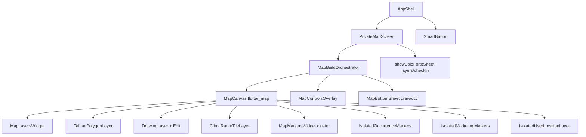

# Estudo UX Mapa Premium — SoloForte

**Status:** APROVADO (anotação → backlog)  
**Data:** 2026-08-07  
**Escopo:** somente-leitura + backlog priorizado. Stack preservada: `flutter_map` · Riverpod · GoRouter Map-First · SmartButton imutável · sem sub-rotas em `/map`.

---

## 1. Diagnóstico do estado atual

### Arquitetura real

O mapa privado é o hub L0. A UI vive principalmente em `lib/ui/` (não em `lib/modules/map/`, que é fino):

**Arquivos-chave:**
- Orquestração: `lib/ui/screens/private_map_screen.dart`, `lib/ui/screens/map/widgets/map_build_orchestrator.dart`
- Canvas/camadas: `lib/ui/components/map/widgets/map_canvas.dart`, `map_layers.dart`, `isolated_marker_layers.dart`
- Chrome: `map_controls_overlay.dart`, `lib/modules/map/presentation/widgets/visit_active_card.dart`
- Sheets: dual path — stack `map_bottom_sheet.dart` vs modal `soloforte_sheet.dart`
- Tokens: `design_tokens.dart`, `sheet_tokens.dart`

### Já alinhado a “premium”

- Design tokens iOS (`PremiumTokens`, glass blur em cards de contexto)
- Isolamento de layers GPS/ocorrências/marketing (ADR-025 / Sprint 8)
- Clustering de publicações
- Offline tiles + cobertura visual
- Tools unificados em um FAB + sheet
- Visit context chip glass (canto superior esquerdo)
- Radar como overlay real (ADR-043)

### Dívidas estruturais que afetam UX

| Dívida | Impacto |
|---|---|
| Dois sistemas de sheet (stack vs modal) + race/BUGFIX de pop | Flicker, inconsistência de gestos/detents |
| `mapCameraSnapshotProvider` a cada `onPositionChanged` | Rebuild de tiles/offline durante pan |
| Ocorrências e marketing sem clustering | Densidade visual e jank em zoom alto |
| `TalhaoPolygonLayer` remapeia todos os polígonos na seleção | Custo O(n) desnecessário |
| Hit-test linear de talhões no tap | Latência perceptível com muitos fields |
| Camera move sem animação (só `move`/`fitCamera`) | Sensação “seca” vs Apple Maps |
| FAB safe-area documentado vs AppShell real divergentes | Controles podem colidir com SmartButton |
| Agenda/visita sem pins no mapa | Contexto operacional só em chrome/sheets |
| `MapAgendaAiButton` / `MapDockGlass` / `IsolatedPublicationMarkersLayer` pouco ou não wired | Código paralelo / superfície morta |

**Nuance FAB (validada em código):** `kFabSafeArea` documentava `bottom: 40` fixo (total 100dp), mas `AppShell` usa `MediaQuery.padding.bottom + 16`. Em iPhone com gesture bar o FAB sobe; a constante de scroll não acompanha.

---

## 2. Benchmarks (inspiração, sem copiar tech)

### A) Apple Maps — norte premium

1. Mapa como herói — chrome mínimo
2. Glass + tipografia calm
3. Localização em 1 gesto (idle / follow / heading) + haptic
4. Transições de câmera (fly-to / ease)
5. Search-first contextual
6. Contexto de visita/talhão ancorado ao mapa
7. Detents previsíveis; mapa reage (padding) ao sheet

### B) Google Maps + FieldView + Field Area — norte agri

| Padrão | Referência | Relevância SoloForte |
|---|---|---|
| Camadas por contexto (satélite, NDVI, boundaries) | FieldView | Layers sheet; NDVI ainda é sheet |
| Seleção de field com highlight + card | FieldView / Field Area | Talhão → snackbar hoje |
| Cluster + progressive disclosure | Google Maps | Só pubs clusterizam |
| Offline areas explícitas | FieldView | Já existe |
| Medição discreta | Field Area | Drawing; pode ser mais calm |
| Check-in / scouting | FieldView | Armed modes + check-in |

---

## 3. Gaps de usabilidade

### P0 — fricção diária

1. Sheets dual-path (stack vs modal)
2. Armed modes pouco guiados (banner Material + snackbar)
3. Talhão selected = snackbar (não card glass)
4. Coluna direita densa vs SmartButton
5. `modo=foco` sem aterrissagem (jump zoom 17 + pin vermelho)
6. Follow GPS: estados ok; falta feedback visual Apple-like

### P1 — descoberta e contexto

7. Busca cliente/fazenda/talhão no mapa
8. Agenda sem pins no mapa
9. NDVI só via sheet (não overlay de camada)
10. `MapAgendaAiButton` não montado no chrome vivo

---

## 4. Gaps de desempenho

| # | Melhoria | Efeito |
|---|---|---|
| D1 | Throttle `mapCameraSnapshotProvider` (100–250ms / zoom bucket) | Menos rebuild no pan |
| D2 | Cluster de ocorrências | Menos widgets no zoom médio |
| D3 | Viewport culling occ/talhões | Menos geometria off-screen |
| D4 | Memoizar polígonos; só restyle selected | Seleção barata |
| D5 | Hit-test espacial (R-tree / grid) | Tap responsivo |
| D6 | Debounce tiers zoom marketing | Menos rebuild ao pinçar |
| D7 | Radar: isolar timer | Frame swap mais leve |
| D8 | Uma verdade para pubs cluster vs IsolatedPublication | Remover path morto |
| D9 | Alinhar `kFabSafeArea` com AppShell | Menos colisão chrome |

**Manter:** isolation GPS, `RepaintBoundary`, `.select()` drawing, cluster pubs, `distanceFilter: 5m`.

---

## 5. Gaps visuais (premium, sem redesign DS)

- Menos chrome, mais mapa
- Glass consistente (armed, pin callout, location, status)
- Pins SF (`SFIcons.pinFill`); tamanhos progressivos
- Tipografia calm; evitar snackbar como feedback principal
- Motion: (1) ease câmera; (2) sheet detent spring; (3) location state morph
- Field highlight stroke claro + fill suave
- Offline coverage tons suaves

**Respeitar:** SmartButton imutável; sheets via `SoloForteSheetTokens`; sem redesign global de tema.

---

## 6. Backlog — Sprints A→D

### Sprint A — Sensação premium imediata
- Unificar visual banners/armed modes + destination pin SF
- Card de talhão selecionado (glass)
- Animação de câmera no foco (tween / ease — sem trocar engine)
- Alinhar `kFabSafeArea` com AppShell (`padding.bottom + 16`)
- Haptics leves em location / check-in / arm

### Sprint B — Desempenho perceptível
- Throttle camera snapshot (D1)
- Cluster ocorrências (D2)
- Memoização talhões + culling (D3–D4)
- Hit-test espacial (D5)

### Sprint C — Sheets e chrome
- Contrato UX único de detents (dual implementation interna ok se necessário)
- Progressive disclosure da coluna direita
- Padding do mapa quando sheet medium/expanded

### Sprint D — Contexto operacional
- Pins de agenda do dia (via contrato, sem import cross-module ilegal)
- Busca cliente/fazenda/talhão no mapa
- Avaliar NDVI como overlay opcional — produto + ADR se contrato mudar

**Gate de contrato (2026-08-07):**
- `AgendaEventData` não expõe `startAt` nem lat/lng → pins do dia exigem extensão de contrato + ADR antes de implementar.
- `ClientSummary` não tem coordenadas → busca contextual no mapa precisa de resolução via `IFarmLookup`/`IFieldLookup` (bbox) + ADR se DTO mudar.
- **NDVI:** manter sheet da visita; overlay GeoTIFF genérico já existe. Overlay NDVI-specific = decisão de produto + ADR se contrato mudar. **Não implementar nesta leva.**

### Explicitamente fora de escopo
- Trocar para `google_maps_flutter`
- Sub-rotas `/map/*`
- Alterar `smart_button.dart`
- Redesign global de tema
- Hard delete / mudanças de schema

---

## 7. Critérios de sucesso

- Map-First intacto; `arch_check.sh` Exit 0
- Pan/zoom fluido em device mid-range com N talhões + ocorrências típicos
- Chrome não compete com o mapa no primeiro viewport
- Sheets sentem-se um sistema só
- Localização e foco sentem-se “iOS” (motion + glass + feedback)
- Fronteiras de módulo intactas; NDVI/radar/visita via contratos

---

## 8. Ordem de execução

1. Sprint A (baixo risco arquitetural)
2. Sprint B (perf localizada)
3. Sprint C (UX sheets — cuidado com race/pop)
4. Sprint D (produto; ADR se necessário)
