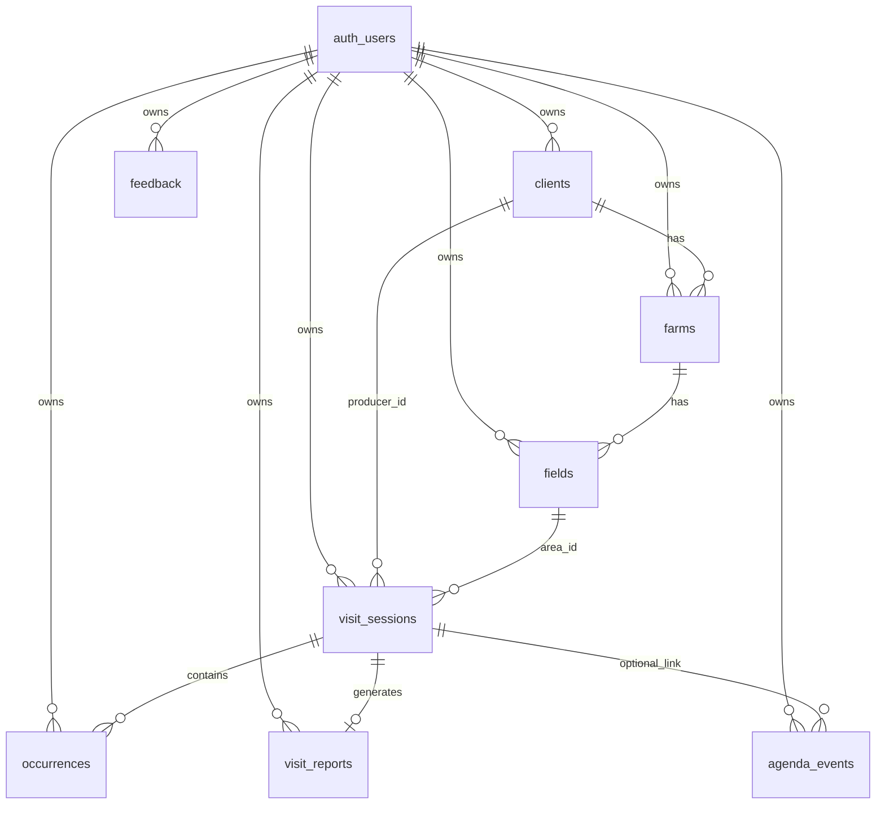

# Relatório Completo — Supabase SoloForte

**Versão:** 1.0  
**Data:** 29/06/2026  
**Projeto Supabase:** `https://pyoejhhkjlrjijiviryq.supabase.co`  
**Branch de referência:** `main`

Este documento é a **especificação oficial** de como o backend Supabase do SoloForte deve estar configurado. Para o passo a passo operacional no SQL Editor, use [`docs/SUPABASE_MANUAL.md`](SUPABASE_MANUAL.md).

---

## 1. Visão geral

| Aspecto | Definição |
|---------|-----------|
| **Papel do Supabase** | Autenticação (Auth) + persistência remota para sync batch |
| **Modo de sync** | Offline-first; push/pull silencioso ao reconectar (não realtime) |
| **Isolamento** | Cada usuário vê apenas seus dados via RLS `user_id = auth.uid()` |
| **Exclusão de conta** | RPC `delete_own_account()` + `ON DELETE CASCADE` nas FKs |
| **Objetos no schema `public`** | 8 tabelas + 1 função RPC |

### Princípios obrigatórios

1. Toda tabela de dados tem `user_id UUID NOT NULL REFERENCES auth.users(id) ON DELETE CASCADE`.
2. RLS sempre usa `user_id = auth.uid()` — **nunca** `USING (true)`.
3. Colunas devem bater com o SQLite local + sync do app Flutter (branch `main`).
4. `sync_status` existe **somente no SQLite local** — não existe no Supabase.

### Scripts SQL (ordem de execução)

| # | Arquivo | Conteúdo |
|---|---------|----------|
| 1 | [`supabase_schema.sql`](../supabase_schema.sql) | 7 tabelas + RLS |
| 2 | [`supabase/auth_delete_account.sql`](../supabase/auth_delete_account.sql) | RPC exclusão de conta |
| 3 | [`supabase/feedback_table.sql`](../supabase/feedback_table.sql) | Tabela feedback |

---

## 2. Diagrama de relacionamentos



**Leitura do diagrama:**

- `producer_id` em `visit_sessions` / `agenda_events` → `clients.id`
- `area_id` em `visit_sessions` / `agenda_events` → `fields.id`
- `fazenda_id` em `fields` → `farms.id`
- `cliente_id` em `farms` → `clients.id`

---

## 3. Inventário de objetos

| # | Nome | Tipo | Fase | Sync app |
|---|------|------|------|----------|
| 1 | `clients` | Tabela | Agronômico | Sim |
| 2 | `farms` | Tabela | Agronômico | Sim |
| 3 | `fields` | Tabela | Agronômico | Sim |
| 4 | `visit_sessions` | Tabela | Campo | Sim |
| 5 | `occurrences` | Tabela | Campo | Sim |
| 6 | `visit_reports` | Tabela | Campo | Sim |
| 7 | `agenda_events` | Tabela | Campo | Sim |
| 8 | `feedback` | Tabela | Fase 3 | Insert only (app) |
| — | `delete_own_account()` | RPC | Auth | Chamada in-app |

**Total esperado após setup:** 8 tabelas em `public` + 1 função.

---

## 4. Especificação por tabela

### 4.1 `public.clients` — Clientes / produtores

**Finalidade:** cadastro agronômico de clientes atendidos pelo consultor.

| Coluna | Tipo | Null | FK / Default | Descrição |
|--------|------|------|--------------|-----------|
| `id` | UUID | NOT NULL | PK | UUID gerado no app |
| `user_id` | UUID | NOT NULL | → `auth.users(id)` CASCADE | Dono do registro |
| `nome` | TEXT | NOT NULL | — | Nome do cliente |
| `documento` | TEXT | NULL | — | CPF/CNPJ |
| `telefone` | TEXT | NULL | — | Telefone |
| `email` | TEXT | NULL | — | E-mail |
| `created_at` | TIMESTAMPTZ | NOT NULL | — | Criação |
| `updated_at` | TIMESTAMPTZ | NOT NULL | — | Última alteração (sync LWW) |
| `deleted_at` | TIMESTAMPTZ | NULL | — | Soft delete |

**RLS:** 4 políticas — `clients_select_own`, `clients_insert_own`, `clients_update_own`, `clients_delete_own`  
**Regra:** `user_id = auth.uid()`  
**App:** `AgronomicSyncService` — push de linhas dirty + pull delta por `updated_at`

---

### 4.2 `public.farms` — Fazendas

**Finalidade:** fazendas vinculadas a um cliente.

| Coluna | Tipo | Null | FK / Default | Descrição |
|--------|------|------|--------------|-----------|
| `id` | UUID | NOT NULL | PK | |
| `user_id` | UUID | NOT NULL | → `auth.users(id)` CASCADE | |
| `cliente_id` | UUID | NOT NULL | → `clients(id)` CASCADE | Cliente pai |
| `nome` | TEXT | NOT NULL | — | Nome da fazenda |
| `area_total` | REAL | NULL | — | Área total (ha) |
| `municipio` | TEXT | NULL | — | Município |
| `uf` | TEXT | NULL | — | UF |
| `created_at` | TIMESTAMPTZ | NOT NULL | — | |
| `updated_at` | TIMESTAMPTZ | NOT NULL | — | |
| `deleted_at` | TIMESTAMPTZ | NULL | — | Soft delete |

**RLS:** 4 políticas (`farms_*_own`)  
**App:** `AgronomicSyncService`

---

### 4.3 `public.fields` — Talhões

**Finalidade:** talhões/lotes de uma fazenda; geometria usada no mapa e geofence.

| Coluna | Tipo | Null | FK / Default | Descrição |
|--------|------|------|--------------|-----------|
| `id` | UUID | NOT NULL | PK | |
| `user_id` | UUID | NOT NULL | → `auth.users(id)` CASCADE | |
| `fazenda_id` | UUID | NOT NULL | → `farms(id)` CASCADE | Fazenda pai |
| `codigo` | TEXT | NULL | — | Código interno |
| `nome` | TEXT | NOT NULL | — | Nome do talhão |
| `area_produtiva` | REAL | NULL | — | Área produtiva (ha) |
| `bordadura_geo` | JSONB | NULL | — | GeoJSON do polígono |
| `centro_geo` | JSONB | NULL | — | Centroide |
| `created_at` | TIMESTAMPTZ | NOT NULL | — | |
| `updated_at` | TIMESTAMPTZ | NOT NULL | — | |
| `deleted_at` | TIMESTAMPTZ | NULL | — | Soft delete |

**RLS:** 4 políticas (`fields_*_own`)  
**App:** mapa (`TalhaoMapAdapter`), geofence, sync agronômico

**Nota SQLite vs Supabase:** local usa `bordadura_geo` como TEXT JSON; remoto usa JSONB.

---

### 4.4 `public.visit_sessions` — Visitas de campo

**Finalidade:** sessão de check-in/check-out em um talhão.

| Coluna | Tipo | Null | FK / Default | Descrição |
|--------|------|------|--------------|-----------|
| `id` | UUID | NOT NULL | PK | |
| `user_id` | UUID | NOT NULL | → `auth.users(id)` CASCADE | |
| `producer_id` | UUID | NOT NULL | — | `clients.id` |
| `area_id` | UUID | NOT NULL | — | `fields.id` |
| `activity_type` | TEXT | NOT NULL | — | Tipo de atividade |
| `start_time` | TIMESTAMPTZ | NOT NULL | — | Início da visita |
| `end_time` | TIMESTAMPTZ | NULL | — | Fim (check-out) |
| `initial_lat` | DOUBLE PRECISION | NULL | — | GPS inicial |
| `initial_long` | DOUBLE PRECISION | NULL | — | GPS inicial |
| `status` | TEXT | NOT NULL | — | ex.: `active`, `completed` |
| `created_at` | TIMESTAMPTZ | NOT NULL | — | |
| `updated_at` | TIMESTAMPTZ | NOT NULL | — | |

**RLS:** política única `visit_sessions_all_own` (FOR ALL)  
**App:** `VisitSession`, `VisitController`, `RemoteSyncService`  
**Baseline congelado:** lógica de visita/geofence não alterar sem aprovação

**Colunas proibidas (schema antigo):** `cliente_id`, `fazenda_id`, `field_id`, `data_visita`, `notas`

---

### 4.5 `public.occurrences` — Ocorrências agronômicas

**Finalidade:** registros georreferenciados no mapa (doenças, pragas, etc.).

| Coluna | Tipo | Null | FK / Default | Descrição |
|--------|------|------|--------------|-----------|
| `id` | UUID | NOT NULL | PK | |
| `user_id` | UUID | NOT NULL | → `auth.users(id)` CASCADE | |
| `visit_session_id` | UUID | NULL | → `visit_sessions(id)` SET NULL | Auto-bind na visita ativa |
| `type` | TEXT | NOT NULL | — | Tipo/urgência |
| `description` | TEXT | NULL | — | Descrição livre |
| `photo_path` | TEXT | NULL | — | Caminho local da foto |
| `lat` | DOUBLE PRECISION | NULL | — | Latitude |
| `long` | DOUBLE PRECISION | NULL | — | Longitude |
| `category` | TEXT | NULL | — | Doença, Insetos, Daninhas, Nutrientes, Água |
| `status` | TEXT | NULL | default `'draft'` | `draft` ou `confirmed` |
| `created_at` | TIMESTAMPTZ | NOT NULL | — | |
| `updated_at` | TIMESTAMPTZ | NOT NULL | — | Resolução de conflito LWW |

**RLS:** política `occurrences_all_own`  
**App:** modelo `Occurrence` — **contrato congelado** (baseline v1)  
**Relatório PDF:** consome apenas `status = 'confirmed'`

**Colunas proibidas (schema antigo):** `tipo`, `descricao`, `severidade`, `geo`, `fotos`

---

### 4.6 `public.visit_reports` — Relatórios de visita

**Finalidade:** agregação textual/PDF de uma visita (1:1 com sessão).

| Coluna | Tipo | Null | FK / Default | Descrição |
|--------|------|------|--------------|-----------|
| `id` | UUID | NOT NULL | PK | |
| `user_id` | UUID | NOT NULL | → `auth.users(id)` CASCADE | |
| `visit_session_id` | UUID | NOT NULL | → `visit_sessions(id)` CASCADE | UNIQUE |
| `content` | TEXT | NOT NULL | — | Conteúdo do relatório |
| `created_at` | TIMESTAMPTZ | NOT NULL | — | |
| `updated_at` | TIMESTAMPTZ | NOT NULL | — | |

**Constraint:** `UNIQUE (visit_session_id)` — uma visita, um relatório.  
**RLS:** política `visit_reports_all_own`

---

### 4.7 `public.agenda_events` — Agenda

**Finalidade:** eventos agendados de campo.

| Coluna | Tipo | Null | FK / Default | Descrição |
|--------|------|------|--------------|-----------|
| `id` | UUID | NOT NULL | PK | |
| `user_id` | UUID | NOT NULL | → `auth.users(id)` CASCADE | |
| `producer_id` | UUID | NOT NULL | — | `clients.id` |
| `area_id` | UUID | NOT NULL | — | `fields.id` |
| `activity_type` | TEXT | NOT NULL | — | Tipo de atividade |
| `scheduled_date` | TIMESTAMPTZ | NOT NULL | — | Data/hora agendada |
| `description` | TEXT | NULL | — | Observações |
| `visit_session_id` | UUID | NULL | → `visit_sessions(id)` SET NULL | Após realização |
| `status` | TEXT | NOT NULL | — | Status do evento |
| `realized_at` | TIMESTAMPTZ | NULL | — | Quando realizado |
| `created_at` | TIMESTAMPTZ | NOT NULL | — | |
| `updated_at` | TIMESTAMPTZ | NOT NULL | — | |

**RLS:** política `agenda_events_all_own`  
**App:** `AgendaScreen`, `AgendaRepository`

---

### 4.8 `public.feedback` — Feedback in-app

**Finalidade:** formulário de feedback do usuário (Fase 3).

| Coluna | Tipo | Null | FK / Default | Descrição |
|--------|------|------|--------------|-----------|
| `id` | UUID | NOT NULL | PK | `gen_random_uuid()` |
| `user_id` | UUID | NOT NULL | → `auth.users(id)` CASCADE | |
| `category` | TEXT | NOT NULL | — | `geral`, `bug`, `sugestao` |
| `message` | TEXT | NOT NULL | — | Texto (mín. 10 chars no app) |
| `app_version` | TEXT | NULL | — | ex.: `1.0.0` |
| `created_at` | TIMESTAMPTZ | NOT NULL | default `now()` | |

**RLS:**

| Política | Operação | Regra |
|----------|----------|-------|
| `feedback_insert_own` | INSERT | `user_id = auth.uid()` |
| `feedback_select_own` | SELECT | `user_id = auth.uid()` |

**App:** `FeedbackScreen` — fallback mailto se Supabase indisponível.

**Colunas proibidas (schema antigo):** `tipo`, `mensagem`, `plataforma`

---

## 5. Função RPC — `delete_own_account()`

| Propriedade | Valor |
|-------------|-------|
| **Schema** | `public` |
| **Retorno** | `void` |
| **Segurança** | `SECURITY DEFINER` |
| **Grant** | `EXECUTE` para `authenticated` apenas |
| **Comportamento** | `DELETE FROM auth.users WHERE id = auth.uid()` |
| **Limpeza de dados** | CASCADE via FKs `user_id` em todas as tabelas |

**App:** `AuthService.deleteAccount()` → `rpc('delete_own_account')`  
**Obrigatório Apple:** exclusão de conta in-app funcional.

---

## 6. Resumo de políticas RLS

| Tabela | Políticas | Padrão |
|--------|-----------|--------|
| `clients` | select, insert, update, delete | `user_id = auth.uid()` |
| `farms` | select, insert, update, delete | `user_id = auth.uid()` |
| `fields` | select, insert, update, delete | `user_id = auth.uid()` |
| `visit_sessions` | all | `user_id = auth.uid()` |
| `occurrences` | all | `user_id = auth.uid()` |
| `visit_reports` | all | `user_id = auth.uid()` |
| `agenda_events` | all | `user_id = auth.uid()` |
| `feedback` | insert, select | `user_id = auth.uid()` |

**Proibido:** `"Enable all for authenticated users"` com `USING (true) WITH CHECK (true)`.

---

## 7. Configuração Auth (Dashboard)

| Configuração | Recomendação dev | Recomendação produção |
|--------------|------------------|----------------------|
| Email provider | Habilitado | Habilitado |
| Confirm email | Off (login imediato) ou confirmar manualmente | On |
| Conta demo review | `review@soloforte.app` confirmada no Dashboard | Para App Store / Play review |
| JWT / sessão | Gerenciado pelo Supabase | Refresh automático no app |

**Chave pública do app** (Dashboard):

| Prioridade | Caminho | Uso no Flutter |
|------------|---------|----------------|
| **Recomendado** | Project Settings → **API Keys → Publishable key** | Valor de `SUPABASE_ANON_KEY` |
| Alternativa | API Keys *(Legacy)* → `anon` `public` | Ainda funciona; prefira Publishable |

**Variáveis Flutter** (`--dart-define` ou `dart_defines.json`):

```bash
flutter run \
  --dart-define=SUPABASE_URL=https://pyoejhhkjlrjijiviryq.supabase.co \
  --dart-define=SUPABASE_ANON_KEY=SUA_PUBLISHABLE_KEY
```

Definidas em [`lib/core/config/app_config.dart`](../lib/core/config/app_config.dart).  
**Nunca** commitar a chave. **Nunca** usar `service_role` no app mobile.

---

## 8. Sync — mapeamento SQLite local ↔ Supabase

| Aspecto | SQLite local | Supabase remoto |
|---------|--------------|-----------------|
| `sync_status` | INTEGER (0=synced, 1=dirty) | **Não existe** |
| `user_id` | Injetado no push | Coluna obrigatória |
| IDs | TEXT (UUID string) | UUID |
| Geo talhão | TEXT JSON | JSONB |
| Conflito | Last-write-wins por `updated_at` | Idem |

**Ordem de sync** ([`RemoteSyncService`](../lib/core/services/remote_sync_service.dart)):

1. Agronômico: clients → farms → fields  
2. visit_sessions (push + pull)  
3. occurrences (push + pull)  
4. visit_reports (push + pull)  
5. agenda_events (push + pull)

No push, o app remove `sync_status` e adiciona `user_id = auth.uid()`.

---

## 9. Reset completo (projeto novo ou recomeço)

```sql
DROP TABLE IF EXISTS public.feedback CASCADE;
DROP TABLE IF EXISTS public.agenda_events CASCADE;
DROP TABLE IF EXISTS public.visit_reports CASCADE;
DROP TABLE IF EXISTS public.occurrences CASCADE;
DROP TABLE IF EXISTS public.visit_sessions CASCADE;
DROP TABLE IF EXISTS public.fields CASCADE;
DROP TABLE IF EXISTS public.farms CASCADE;
DROP TABLE IF EXISTS public.clients CASCADE;
DROP FUNCTION IF EXISTS public.delete_own_account();
```

Em seguida, executar os 3 scripts na ordem da seção 1.

---

## 10. Queries de verificação

**Critério de aprovação:** 8 tabelas + função + colunas críticas + RLS ativo.

```sql
-- 1. Inventário de tabelas (esperado: 8 linhas)
SELECT tablename FROM pg_tables
WHERE schemaname = 'public'
  AND tablename IN (
    'clients','farms','fields','visit_sessions',
    'occurrences','visit_reports','agenda_events','feedback'
  )
ORDER BY tablename;

-- 2. Função de exclusão
SELECT proname FROM pg_proc WHERE proname = 'delete_own_account';

-- 3. RLS habilitado
SELECT c.relname, c.relrowsecurity
FROM pg_class c
JOIN pg_namespace n ON n.oid = c.relnamespace
WHERE n.nspname = 'public'
  AND c.relname IN ('clients','occurrences','feedback')
ORDER BY c.relname;

-- 4. Colunas críticas visit_sessions
SELECT column_name FROM information_schema.columns
WHERE table_schema = 'public' AND table_name = 'visit_sessions'
  AND column_name IN ('user_id','producer_id','area_id','activity_type','start_time')
ORDER BY column_name;

-- 5. Colunas críticas feedback
SELECT column_name FROM information_schema.columns
WHERE table_schema = 'public' AND table_name = 'feedback'
  AND column_name IN ('category','message','user_id')
ORDER BY column_name;

-- 6. Políticas permissivas proibidas (esperado: 0 linhas)
SELECT schemaname, tablename, policyname
FROM pg_policies
WHERE schemaname = 'public'
  AND qual LIKE '%true%'
  AND policyname LIKE '%Enable all%';
```

---

## 11. Schema proibido (não usar)

Este schema **não é compatível** com o app de release. Não executar.

| Erro comum | Schema incorreto | Schema correto |
|------------|------------------|----------------|
| Visitas | `cliente_id`, `data_visita`, `notas` | `producer_id`, `area_id`, `activity_type`, `start_time` |
| Ocorrências | `tipo`, `descricao`, `geo` | `type`, `description`, `lat`, `long`, `category` |
| Feedback | `tipo`, `mensagem` | `category`, `message` |
| Isolamento | RLS `USING (true)` | RLS `user_id = auth.uid()` |
| Tabelas | Sem coluna `user_id` | `user_id` em todas |

---

## 12. Troubleshooting

| Sintoma | Causa provável | Solução |
|---------|----------------|---------|
| `Supabase não configurado` | Faltam `--dart-define` | Passar URL + Publishable key em `SUPABASE_ANON_KEY` |
| `column "user_id" does not exist` | Schema antigo no banco | Reset + Script 1 correto |
| `column "category" does not exist` | Feedback com schema antigo | Reset feedback + Script 3 |
| `new row violates row-level security` | `user_id` nulo ou errado | App deve enviar `auth.uid()` no insert |
| `function delete_own_account() does not exist` | Script 2 não executado | Executar `auth_delete_account.sql` |
| Sync push falha silenciosamente | Colunas incompatíveis | Conferir seção 4 vs logs (`appLog`) |
| Login OK, sync falha | Schema parcialmente antigo | Queries seção 10 |

---

## 13. Referências cruzadas

| Documento | Conteúdo |
|-----------|----------|
| [`docs/SUPABASE_MANUAL.md`](SUPABASE_MANUAL.md) | Passo a passo SQL Editor |
| [`docs/BUILD_RELEASE.md`](BUILD_RELEASE.md) | Build Android/iOS + dart-define |
| [`docs/FASE3_VALIDACAO.md`](FASE3_VALIDACAO.md) | Checklist de validação release |
| [`docs/store/CONTA_DEMO_REVIEW.md`](store/CONTA_DEMO_REVIEW.md) | Conta demo para review |
| [`.agent/BASELINE_V1_OFICIAL.md`](../.agent/BASELINE_V1_OFICIAL.md) | Baseline congelado (mapa, ocorrências) |
| [`supabase_schema.sql`](../supabase_schema.sql) | Script 1 — fonte de verdade SQL |
| [`supabase/auth_delete_account.sql`](../supabase/auth_delete_account.sql) | Script 2 |
| [`supabase/feedback_table.sql`](../supabase/feedback_table.sql) | Script 3 |

---

## 14. Checklist de conformidade

- [ ] 8 tabelas presentes em `public`
- [ ] Todas com `user_id` + RLS `auth.uid()`
- [ ] Função `delete_own_account()` com GRANT para `authenticated`
- [ ] Feedback com `category` e `message`
- [ ] `visit_sessions` com `producer_id` e `area_id`
- [ ] Sem políticas `USING (true)`
- [ ] App roda com `--dart-define` URL + anon key
- [ ] Teste: login → cliente → sync → feedback → exclusão conta
